# Unified Multi-Runtime Router Core RFC

## Abstract

This document specifies...

## Abstract

This RFC specifies the design and behavior of the Unified Multi‑Runtime Router Core, a navigation
coordination system intended for applications composed of multiple UI runtimes including
Native (iOS/Android), React Native, Flutter, and WebView. The Router Core provides a unified
model for routing, parameters, state transitions, middleware, lifecycle events, and animation
integration across heterogeneous environments.

## 1. Introduction

Modern mobile applications increasingly adopt multi‑runtime architectures to balance flexibility,
performance, and developer productivity. Native screens coexist with React Native modules,
Flutter engines, and sometimes embedded WebViews. However, navigation across these runtimes
remains fragmented. Each runtime exposes its own stack, its own routing semantics, and its own
lifecycle behaviors.

This RFC proposes a unified Router Core that serves as the single source of truth for navigation
state and behavior across all runtimes.

## 2. Problem Definition

### 2.1 Fragmented Navigation Models

Different UI runtimes implement incompatible navigation semantics:

- **iOS/Android Native**: view controllers / activities with OS-level stacking rules.
- **React Native**: JavaScript-driven routing, independent of native VC stack.
- **Flutter**: Navigator + custom engines, each maintaining isolated stacks.
- **WebView**: Browser-like history mechanisms.

This heterogeneity leads to inconsistent state, unclear ownership, and difficult cross-runtime
transitions.

### 2.2 Inconsistent Parameter Passing

Runtimes use distinct formats:

- Native → strongly typed structs.
- React Native → JSON.
- Flutter → Dart objects.
- WebView → URL + message passing.

No unified mechanism ensures:

- validation
- type safety
- parameter schema consistency.

### 2.3 Missing Unified Lifecycle System

Navigation involves phases:

- before routing
- parameter validation
- state transition
- animation start
- animation end

Existing systems lack a single, coherent model that spans all runtimes.

### 2.4 Missing Extensible Middleware Architecture

Routing concerns routinely include:

- authentication
- logging
- dynamic experiments
- multi-tenant rules

Current runtime-specific approaches are not composable or enforceable globally.

### 2.5 No Global Source of Truth

Each runtime maintains its own navigation state, causing:

- divergence
- duplicated logic
- unpredictable behavior
- impossible debugging

---

## 3. Design Overview

The Router Core unifies navigation across all runtimes by acting as the **central authority** for:

- routing resolution
- parameter merging & validation
- middleware processing
- cross-runtime state transitions
- command emission to each runtime
- lifecycle (hooks)
- animation events

The high-level architecture is illustrated below.

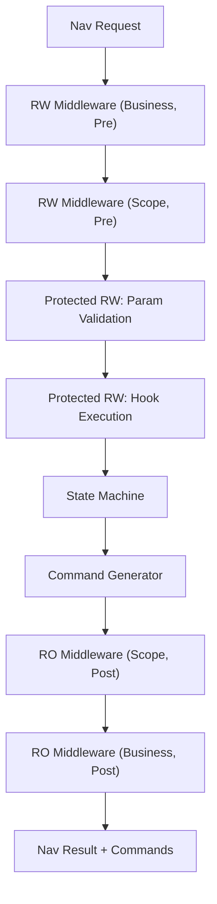

### 3.1 Core Principles

1. **Single Source of Truth**  
   Router Core maintains a global, authoritative navigation state.

2. **Runtime-Agnostic**  
   Commands abstract native / RN / Flutter / WebView behavior.

3. **Deterministic Pipeline**  
   Navigation flows through a fixed middleware sequence.

4. **Protection Layers**  
   Parameter validation + hook execution cannot be bypassed.

5. **Cross-Runtime Guarantees**  
   Navigation state must remain consistent regardless of the UI engine.

---

## 4. Routing Model

### 4.1 Overview

The Router Core introduces a **tree‑structured routing model** inspired by backend routing
systems. Routes are organized hierarchically to reflect business domains and namespaces:

- `/account/profile`
- `/account/security`
- `/orders/:orderId/detail`

Each route is represented as a node in a static **Route Tree** loaded at startup.

### 4.2 Route Tree Structure

A route is composed of:

- **path segment**
  - static (`"account"`)
  - parameterized (`":orderId"`)
  - wildcard (`"*"`, `"**"`)
- **route metadata** (only leaf nodes)
  - name (`"account.profile"`)
  - runtime type
  - parameter schema
  - middleware bindings
  - hook configuration (executed through core middleware)

### 4.3 Route Tree Diagram

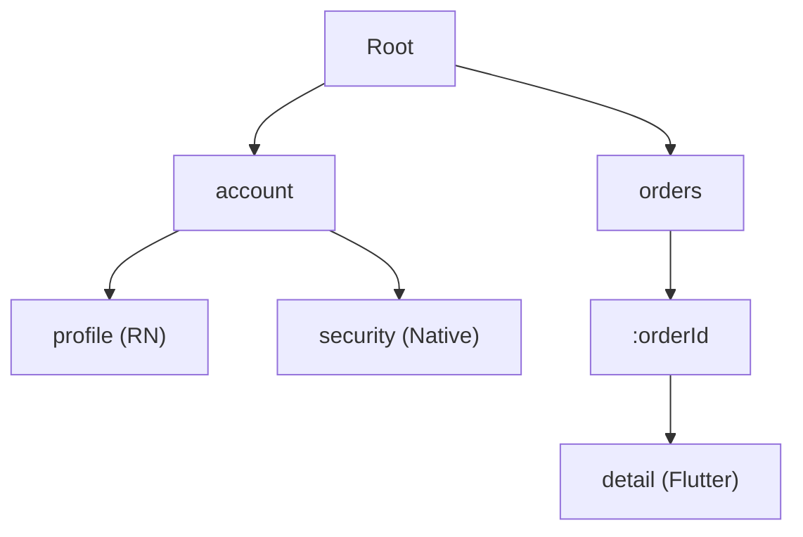

### 4.4 Resolution Modes

Routes can be resolved by either:

1. **Name-based resolution**

   ```
   account.profile
   orders.detail
   ```

2. **Path-based resolution**
   ```
   /orders/123/detail
   /account/profile
   ```

### 4.5 Resolution Algorithm

Given a `NavRequest`:

1. If `ByName`, lookup metadata directly.
2. If `ByPath`, traverse the route tree:
   - match each segment
   - capture path parameters
   - ensure matches end at a leaf

### 4.6 Resolution Flow

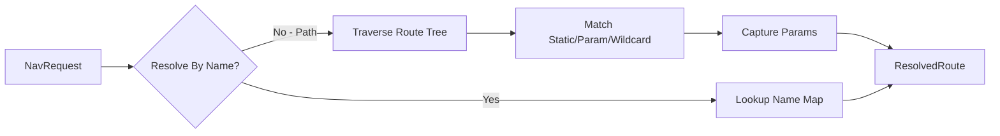

### 4.7 ResolvedRoute

A resolved route includes:

- the leaf route's metadata
- full normalized path
- path parameters
- ancestors (for subtree middleware inheritance)

### 4.8 Namespace and Business Isolation

Namespaces map naturally to top‑level route segments:

- `account.…`
- `orders.…`
- `settings.…`

This enables:

- Business‑level separation
- Scoped middleware
- Modular team ownership
- Clear navigation boundaries

---

## 5. Parameter Model

### 5.1 Overview

The Router Core supports **two complementary parameter channels**, mirroring HTTP semantics:

1. **Query Parameters** — always strings
2. **Body Parameters** — arbitrary structured data (via pluggable codecs)

These are merged into a unified **Canonical Parameter Model** used by the Router Core,
middleware, hooks, and runtimes.

### 5.2 Query Parameters

Query parameters are lightweight key–value pairs passed directly in the navigation
request. They:

- must be strings
- preserve order
- are ideal for short, URL-like flags

Examples:

```
?tab=profile&source=notification
```

### 5.3 Body Parameters

Body parameters are encoded payloads intended for:

- rich data (objects, arrays)
- typed information
- large structured inputs

Body supports multiple codecs:

- JSON (default)
- Protobuf
- MsgPack
- CBOR (optional)
- Custom codecs via registry

### 5.4 Codec Registry

The Router Core includes a pluggable **CodecRegistry**:

```text
JSONCodec      → application/json
ProtobufCodec  → application/x-protobuf
MsgPackCodec   → application/msgpack
...
```

The registry maps `content_type → decoder`.

### 5.5 Canonical Parameters

The Router Core merges both channels into a **canonical JSON object**:

```
CanonicalParams {
    query:   Map<String, String>,
    body:    JsonValue,     // decoded from codec
    merged:  JsonValue      // unified view passed to validation & hooks
}
```

### 5.6 Merge Rules

1. Query parameters become strings under `query`.
2. Body is decoded into `JSON`.
3. `merged` is produced by:
   - shallow merging
   - with **body taking precedence** over query

Example:

```
Query:  { "id": "123", "mode": "view" }
Body:   { "mode": "edit", "user": { "name": "A" } }

Merged:
{
  "id": "123",
  "mode": "edit",
  "user": { "name": "A" }
}
```

### 5.7 Canonical Flow Diagram

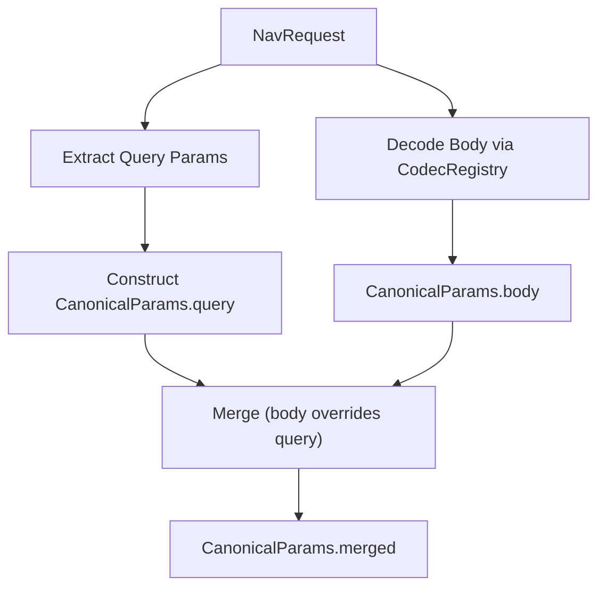

### 5.8 Motivation for Canonical Model

- Middleware gains stable structured input
- Schema validation operates on a single JSON object
- Hooks receive unified semantic parameters
- All runtimes (Native/RN/Flutter/WebView) can reconstruct structured inputs deterministically

### 5.9 Validation Readiness

The CanonicalParams are passed directly into:

- **CoreParamValidationMiddleware**
- Defined JSON Schemas
- Hook execution context

Ensuring the parameter surface is:

- predictable,
- validated,
- runtime-agnostic,
- type-coherent.

---

## 6. Middleware System

### 6.1 Overview

The Router Core defines a unified **middleware pipeline** that all navigation requests must flow
through. Middleware provides a structured, composable way to introduce cross-cutting logic such
as authentication, logging, multi-tenant rules, or dynamic routing constraints.

Middleware in this RFC is divided into:

- **Business Middleware (customizable)**
- **Core Middleware (built-in and mandatory)**
- **Post-processing Middleware (read-only)**

Together, these form a deterministic and extensible pipeline.

### 6.2 Middleware Execution Model

A middleware receives:

- the current `NavRequest`
- the `ResolvedRoute`
- `CanonicalParams`
- router state snapshots (pre/post)
- the ability to decide:
  - proceed
  - modify request (RW only)
  - redirect (RW only)
  - cancel (RW only)
  - observe (RO only)

### 6.3 Standard Middleware Flow

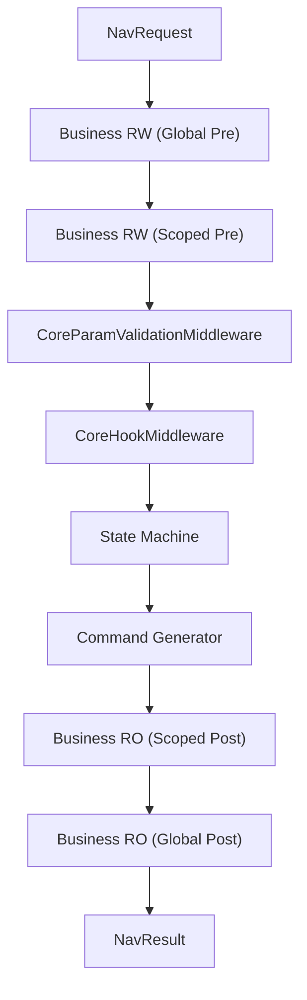

### 6.4 Core Middleware

#### 6.4.1 CoreParamValidationMiddleware

Performs:

- JSON Schema validation
- structural checks
- required fields verification

It ensures:

- invalid navigation cannot proceed
- no runtime receives malformed parameters

#### 6.4.2 CoreHookMiddleware

Executes lifecycle hooks:

- BeforeValidate
- BeforeCommit
- AfterCommitBeforeAnimation
- OnAnimationStart
- OnAnimationEnd

Hooks **do not run directly** but are invoked via this core middleware layer.

### 6.5 Business Middleware

Business middleware may include:

- authentication
- tenant isolation
- logging
- experiment routing
- feature gating
- dynamic access control

Business middleware is inserted exclusively:

- before core validation logic (RW)
- after command generation (RO)

### 6.6 Middleware Ordering Guarantees

1. Business RW middleware always runs **before** core validation.
2. Core middleware is always executed **in fixed order**.
3. Business RO middleware always runs **after** command generation.
4. No middleware can bypass core logic.

### 6.7 Pipeline Immutability

The Router Core enforces:

- middleware order
- core middleware non-removability
- safe transitions between RW → protected → RO zones

This prevents business logic from unintentionally breaking navigation behavior.

---

## 7. Middleware Levels (RO / RW / Protected RW)

### 7.1 Overview

To ensure safety, predictability, and extensibility, middleware is classified into three levels:

1. **RO – Read-only**
2. **RW – Read-Write**
3. **Protected RW – Core Read-Write (non-bypassable)**

### 7.2 RO – Read-only Middleware

Characteristics:

- cannot mutate request
- cannot block navigation
- cannot redirect
- used for:
  - logging
  - metrics
  - monitoring

Runs **after** core logic.

### 7.3 RW – Read-Write Middleware

Characteristics:

- can modify parameters
- can cancel navigation
- can redirect
- placed **before** core logic
- used for:
  - authentication
  - AB testing
  - multi-tenant logic
  - dynamic rules

### 7.4 Protected RW Middleware

Core behavior belongs here:

- Param validation
- Hook execution
- Internal state transitions

They:

- **must run**
- **cannot be removed**
- **cannot be overridden**
- execute in a fixed order

### 7.5 Middleware Permission Matrix

| Level        | Modify Params | Cancel | Redirect | Mandatory | Who Controls |
| ------------ | ------------- | ------ | -------- | --------- | ------------ |
| RO           | ❌            | ❌     | ❌       | No        | Business     |
| RW           | ✔️            | ✔️     | ✔️       | No        | Business     |
| Protected RW | ✔️            | ✔️     | ✔️       | **Yes**   | Core         |

### 7.6 Transition Flow

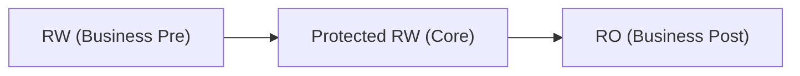

### 7.7 Safety Guarantees

- Business logic cannot skip parameter validation.
- Hooks cannot be bypassed.
- Command generation is always consistent.
- Observability (RO) cannot affect routing behavior.

---

## 8. Navigation Pipeline

### 8.1 Overview

The Router Core defines a **deterministic, runtime‑agnostic pipeline** that processes every
navigation request from initiation to completion. This pipeline ensures:

- predictable routing behavior
- globally enforced validation
- fixed ordering and side‑effect isolation
- consistent state transitions
- cross-runtime command generation
- unified lifecycle and error semantics

The pipeline is divided into **eight major phases**.

---

### 8.2 Pipeline Phases

#### **Phase 1 — Request Intake**

The pipeline begins when any runtime (Native, RN, Flutter, WebView) submits a `NavRequest`.

Input:

- raw request (ByName / ByPath)
- query parameters
- encoded body
- metadata (origin runtime)

Output:

- immutable snapshot of the original request

---

#### **Phase 2 — Route Resolution**

The router identifies the target leaf route:

- name-based lookup
- or tree-based path matching

Output:

- `ResolvedRoute`
- captured path params

Errors:

- unknown route
- ambiguous wildcard match
- missing parameters

---

#### **Phase 3 — Parameter Merging**

Query and body parameters are unified into a `CanonicalParams` object.

Body → decoded using `CodecRegistry`.
Query → string map.
Merged → JSON object (body overrides query).

Output:

- CanonicalParams { query, body, merged }

---

#### **Phase 4 — Pre‑Core Business Middleware (RW)**

Business-defined RW middleware can:

- modify request
- block navigation
- redirect
- attach metadata
- enforce business rules (Auth, A/B, tenant, experiment)

Output:

- possibly mutated request
- or redirected request (restart pipeline)
- or cancellation

Errors:

- Access denied
- Rule violation

---

#### **Phase 5 — Protected Core Middleware**

1. **CoreParamValidationMiddleware**

   - Validate merged parameters against JSON Schema
   - Reject malformed requests

2. **CoreHookMiddleware**
   - Execute lifecycle hooks
   - Allow business logic to cancel or redirect
   - Guarantee ordering

Output:

- Validated canonical params
- Hook side outcomes

Errors:

- validation failure
- beforeCommit hook cancellation
- redirect (restart pipeline)

---

#### **Phase 6 — State Machine**

The central state machine computes:

- transitions across stacks
- runtime boundaries
- push / pop / replace semantics
- constraints (root deletion, empty stack protection)

Output:

- Updated RouterState
- Transition descriptor (from → to)

---

#### **Phase 7 — Command Generator**

The Router Core transforms state diffs into abstract commands:

```
BeginTransition
AttachRuntime
PushRoute
PopRoute
ReplaceTop
EndTransition
```

Commands are delivered to:

- Native adapter
- RN adapter
- Flutter adapter
- WebView adapter

Each adapter interprets commands for its runtime.

---

#### **Phase 8 — Post‑Core Middleware (RO)**

Read‑only middleware observes:

- the resolved route
- canonical parameters
- resulting state
- emitted commands

Used for:

- logging
- telemetry
- metrics
- exposure tracking

Cannot mutate or block.

---

### 8.3 End‑to‑End Sequence Diagram

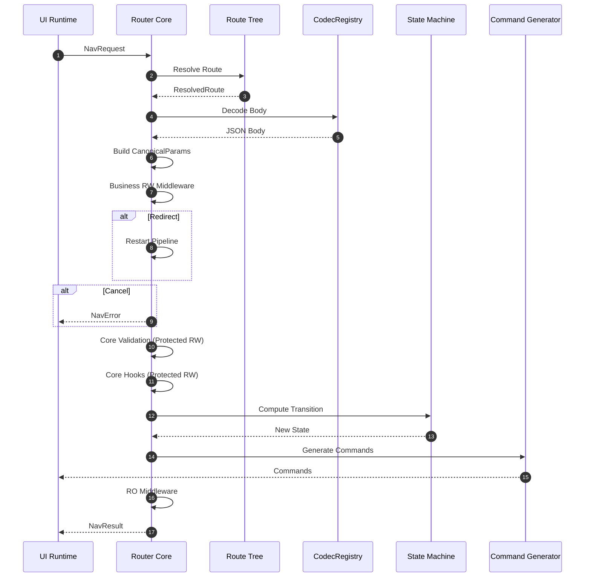

---

### 8.4 Error Propagation Model

Errors propagate as:

1. Business RW middleware cancellation → immediate `NavError`.
2. Parameter validation failure → `InvalidParams`.
3. Hook cancellation → `HookDenied`.
4. State machine violation → `IllegalTransition`.
5. Codec failure → `DecodeError`.

Redirects restart the pipeline with a new request.

---

### 8.5 Redirect Model

Redirects are part of RW middleware and hooks:

- Construct a new `NavRequest`
- Restart the pipeline from Phase 1
- Maintain a redirect counter to prevent loops

---

## 9. State Machine and Commands

### 9.1 Overview

The Router Core maintains an authoritative **RouterState** representing:

- one or more navigation stacks
- per-runtime stack ownership
- current visible route
- pending transitions

The State Machine ensures navigation is:

- deterministic
- cross-runtime consistent
- reversible
- observable

---

### 9.2 Stack Model

Each runtime has a dedicated logical stack:

```text
NativeStack
RNStack
FlutterStack
WebViewStack
```

Only one may be active (visible) at a time.

---

### 9.3 State Transition Categories

Supported transitions include:

- `Push`
- `Pop`
- `Replace`
- `RebuildStack`
- `SwitchRuntime`  
  (implicit when pushing a route belonging to another runtime)

---

### 9.4 Transition Diagram

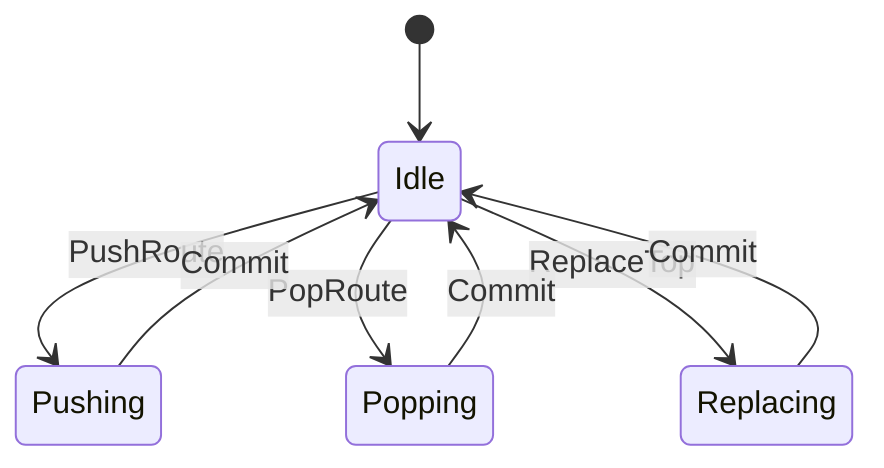

---

### 9.5 Command Generation

Command generation transforms transitions into runtime-neutral instructions:

```text
BeginTransition(id)
AttachRuntime(runtime)
PushRoute(route)
PopRoute
ReplaceTop(route)
EndTransition(id)
```

Adapters convert these commands into:

- view controller transitions (iOS)
- activity/fragment operations (Android)
- navigator operations (Flutter)
- JS navigation dispatch (RN)

---

### 9.6 Command Flow Diagram

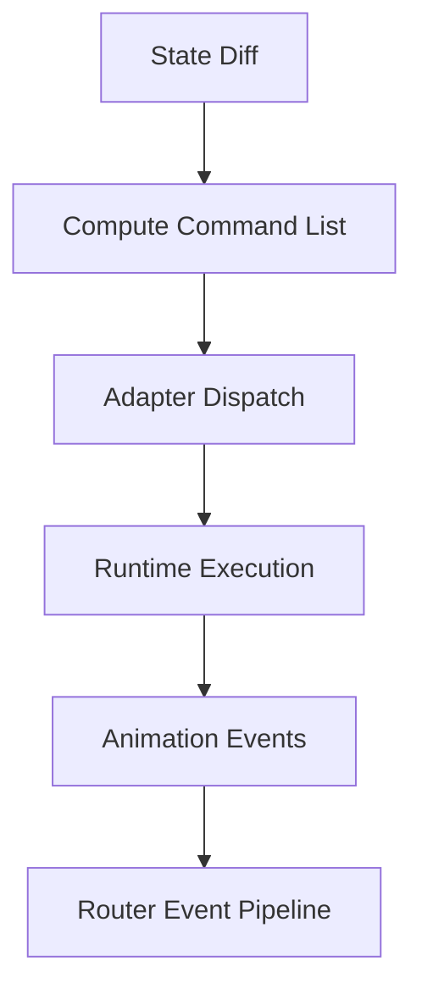

---

## 10. Runtime Adaptation

### 10.1 Overview

Each UI runtime (Native, React Native, Flutter, WebView) interprets navigation commands emitted
from the Router Core through a thin, deterministic adapter layer. These adapters translate abstract
commands into runtime-specific operations while maintaining cross-runtime consistency.

### 10.2 Adapter Responsibilities

- Maintain binding between Router Core and runtime engine
- Execute navigation commands in order
- Emit animation lifecycle events
- Report runtime errors
- Guarantee isolation between runtimes

### 10.3 Adapter Model

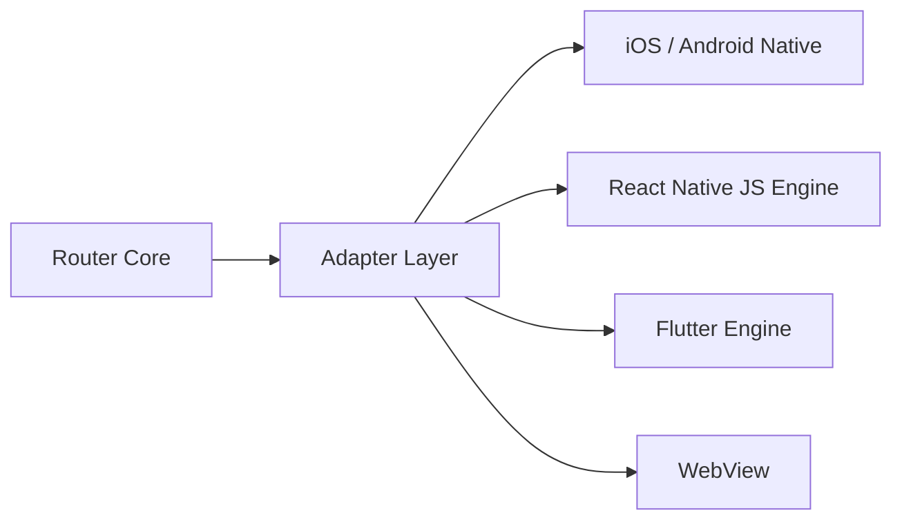

### 10.4 Command Interpretation

| Command             | Native            | RN                | Flutter          | WebView       |
| ------------------- | ----------------- | ----------------- | ---------------- | ------------- |
| PushRoute           | push VC           | JS stack push     | Navigator.push   | history.push  |
| PopRoute            | pop VC            | JS stack pop      | Navigator.pop    | history.back  |
| ReplaceTop          | replace VC        | replace           | pushReplacement  | replaceState  |
| AttachRuntime       | present VC        | activate RN root  | activate engine  | focus webview |
| Begin/EndTransition | transaction block | batched UI update | transition begin | N/A           |

### 10.5 Isolation Guarantees

- Runtimes do not operate on each other's stacks.
- Commands are fully abstract; adapters enforce local invariants.
- Router Core maintains global ordering.

---

## 11. Animation Event Model

### 11.1 Overview

Animations are essential in mobile navigation but vary significantly across runtimes.  
The Router Core introduces a **unified animation event pipeline**.

### 11.2 Animation Phases

- **TransitionStart**
- **AnimationStart**
- **AnimationEnd**
- **TransitionEnd**

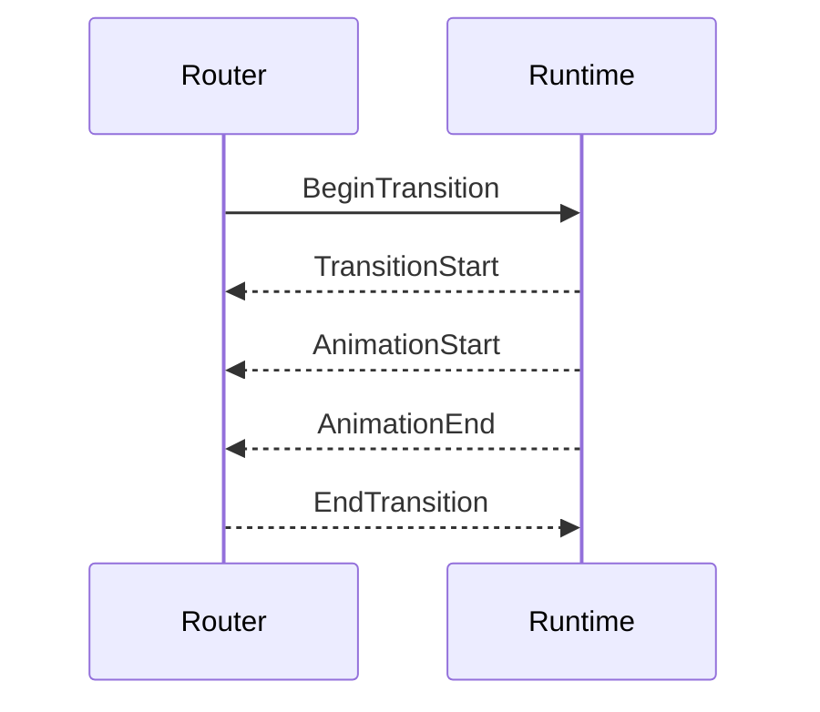

### 11.3 Purpose of Animation Events

- Drive hook phases
- Enable tracking and exposure reporting
- Coordinate multi-runtime animations
- Ensure post-animation state finalization

---

## 12. Deep Linking

### 12.1 Overview

Deep Linking enables navigation from external sources (other apps, browsers, push notifications,
system URLs) into specific routes within the application. Unlike internal navigation, deep links
must be parsed, validated, and transformed before entering the standard navigation pipeline.

The Router Core provides a **two-stage deep linking architecture**:

1. **DeepLinkResolver** — URL parsing and route matching (pre-pipeline)
2. **DeepLinkMiddleware** — Business logic processing (within pipeline)

### 12.2 Deep Link Flow

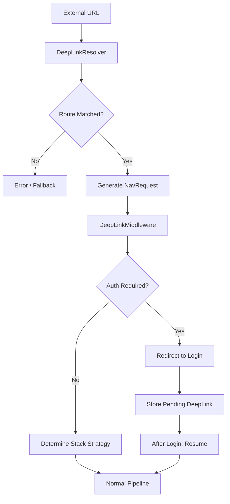

### 12.3 DeepLinkResolver

The DeepLinkResolver is a **pre-pipeline component** that transforms external URLs into `NavRequest` objects.

```text
DeepLinkResolver {
    // URL pattern to route mapping
    patterns: Map<UrlPattern, RouteName>,

    // Extract path and query parameters
    parse(url: String) -> Result<DeepLinkData, DeepLinkError>,

    // Generate NavRequest from parsed data
    resolve(data: DeepLinkData) -> Result<NavRequest, DeepLinkError>,
}

DeepLinkData {
    matched_route: RouteName,
    path_params: Map<String, String>,
    query_params: Map<String, String>,
    source: DeepLinkSource,  // universal_link, app_link, scheme, push
    raw_url: String,
}
```

### 12.4 URL Pattern Configuration

Routes can declare deep link patterns in their definition:

```text
RouteDefinition {
    name: "orders.detail",
    path: "/orders/:orderId/detail",
    runtime: Flutter,

    deep_link: DeepLinkConfig {
        patterns: [
            "https://myapp.com/orders/{orderId}",
            "https://myapp.com/o/{orderId}",
            "myapp://orders/{orderId}",
        ],
        requires_auth: true,
        stack_behavior: ClearToRootAndPush,
    }
}
```

### 12.5 DeepLinkMiddleware

The DeepLinkMiddleware is a **RW Middleware** that handles deep link-specific business logic:

```text
DeepLinkMiddleware {
    fn on_pre(ctx: &mut NavContext) -> MiddlewareResult {
        if !ctx.is_deep_link() {
            return Continue;
        }

        // 1. Check authentication if required
        if ctx.route.requires_auth && !ctx.is_authenticated() {
            return Redirect(LoginRoute, pending: ctx.request);
        }

        // 2. Apply stack behavior
        ctx.set_stack_behavior(ctx.route.deep_link.stack_behavior);

        // 3. Track deep link analytics
        Analytics::track_deep_link(ctx.deep_link_data);

        Continue
    }
}
```

### 12.6 Stack Behavior Strategies

When a deep link arrives, the Router Core must decide how to integrate the target route into
the existing navigation stack:

| Strategy             | Behavior                 | Use Case                           |
| -------------------- | ------------------------ | ---------------------------------- |
| `Push`               | Push onto current stack  | Preserve user's navigation context |
| `ClearAndPush`       | Clear stack, push target | Fresh start for the deep link      |
| `ClearToRootAndPush` | Pop to root, then push   | Maintain root but clear history    |
| `PopToIfExists`      | Pop to route if in stack | Avoid duplicate routes             |

### 12.7 Cold Start vs Warm Start

Deep links behave differently depending on app state:

| Scenario                    | Handling                                                                               |
| --------------------------- | -------------------------------------------------------------------------------------- |
| **Cold Start**              | App initializes → Router Core loads → Resolve pending deep link → Apply stack behavior |
| **Warm Start (Background)** | Router Core already active → Immediately process deep link                             |
| **Foreground**              | Treat as normal navigation with deep link metadata                                     |

```text
ColdStartHandler {
    pending_deep_link: Option<String>,

    fn on_router_ready() {
        if let Some(url) = pending_deep_link {
            Router.handle_deep_link(url);
        }
    }
}
```

### 12.8 Deferred Deep Linking

For users who install the app after clicking a link (via app store):

```text
DeferredDeepLink {
    url: String,
    source: String,           // campaign, referrer
    timestamp: i64,
    expiry: Duration,         // typically 24-48 hours
}

// Typically implemented via third-party SDKs (Branch, AppsFlyer, Adjust)
// Router Core provides hooks for integration
DeferredDeepLinkHandler {
    fn on_first_launch() -> Option<DeferredDeepLink>,
    fn apply(link: DeferredDeepLink) -> NavRequest,
}
```

### 12.9 Deep Link Error Handling

```text
DeepLinkError {
    UnknownRoute,           // No pattern matched
    InvalidParameters,      // Required params missing
    Expired,               // Deferred link expired
    AuthenticationRequired, // User not logged in
    PermissionDenied,      // User lacks access
}

// Fallback behavior configuration
DeepLinkFallback {
    on_unknown_route: FallbackAction,     // ShowError | GoHome | OpenBrowser
    on_auth_required: FallbackAction,     // GoLogin | ShowError
    on_permission_denied: FallbackAction, // ShowError | GoHome
}
```

---

## 13. Module System and Navigation API

### 13.1 Overview

The Router Core introduces a **Module-based architecture** where modules serve as first-class
namespaces for organizing navigation stacks. This design decouples route definitions from
their display context, enabling the same route to be pushed onto any module's stack without
redundant registration.

Key concepts:

- **Module**: A namespace that owns a navigation stack (similar to a "domain")
- **Route**: A page definition, globally unique and module-independent
- **Tab**: A UI representation of modules (optional, modules can exist without tabs)

### 13.2 Why Module as Namespace

Traditional designs couple tabs into the route path:

```text
// Traditional: Route duplication problem
/home/products/:id      → ProductDetail
/search/products/:id    → ProductDetail  // Duplicate!
/favorites/products/:id → ProductDetail  // Duplicate!
```

Module-based design separates concerns:

```text
// Module design: Routes registered once
RouteRegistry {
    products/:id → ProductDetail  // Single registration
}

// Navigation specifies target module
home://products/123      // Push to home stack
search://products/123    // Push to search stack
favorites://products/123 // Push to favorites stack
```

### 13.3 Module Definition

```text
ModuleDefinition {
    id: ModuleId,              // "home", "search", "account"
    name: String,              // Display name
    rootPath: String,          // Root route path
    runtime: Runtime,          // Which runtime renders this module

    // Optional: Tab configuration (if module appears in tab bar)
    tab: Option<TabConfig> {
        index: u32,            // Tab bar position
        icon: IconResource,
        badge: Option<Badge>,
    },
}

// Special modules
MODULE._global    // For modals/overlays, no tab representation
MODULE.home       // Typically the default/main module
```

### 13.4 Route and Module Relationship

Routes are **globally unique** and **module-independent**:

```text
RouteDefinition {
    path: "/products/:id",
    name: "product.detail",
    runtime: Runtime.Flutter,

    // Routes do NOT specify which module they belong to
    // They can be pushed to ANY module's stack
}
```

### 13.5 Extended State Model

```text
RouterState {
    // Module stacks (module_id → navigation stack)
    module_stacks: Map<ModuleId, Vec<Route>>,

    // Currently active module
    active_module: ModuleId,

    // Global stack for modals (above all modules)
    global_stack: Vec<Route>,

    // Active runtime
    active_runtime: Runtime,
}
```

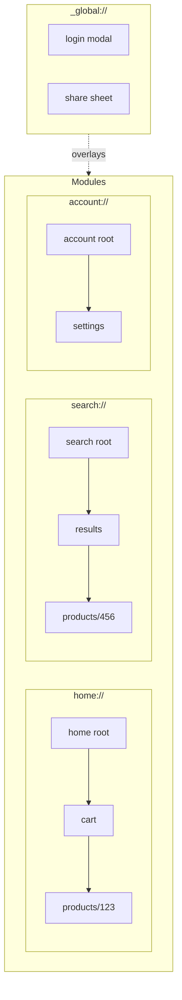

### 13.6 Navigation API Design

The Router Core provides a **structured, type-safe API** rather than string-based URIs:

```text
// Module enum (type-safe)
enum MODULE {
    HOME = "home",
    SEARCH = "search",
    ACCOUNT = "account",
    ORDERS = "orders",
    _GLOBAL = "_global",
}

// Navigation API
interface NavigationAPI {
    navigate(options: NavOptions): Promise<NavResult>;
    push(path: String, module?: MODULE): Promise<NavResult>;
    pop(): Promise<NavResult>;
    replace(options: NavOptions): Promise<NavResult>;
    switchModule(module: MODULE): Promise<NavResult>;
    popToRoot(): Promise<NavResult>;
}

NavOptions {
    module?: MODULE,          // Target module (default: current)
    path: String,             // Route path
    params?: Map<String, Any>,// Query parameters
    body?: Any,               // Body parameters
    options?: {
        animated: bool,
        presentation: Presentation,  // push | modal | replace
    }
}
```

### 13.7 Navigation Examples

```text
// Navigate within current module
router.navigate({
    path: "/products/123",
    params: { from: "banner" }
});

// Navigate to specific module
router.navigate({
    module: MODULE.SEARCH,
    path: "/results",
    params: { query: "phone" }
});
// Internally: Switch to search module + Push /results

// Open global modal
router.navigate({
    module: MODULE._GLOBAL,
    path: "/login",
});

// Convenience methods
router.push("/products/123");                  // Current module
router.push("/products/123", MODULE.HOME);    // Specific module
router.switchModule(MODULE.ORDERS);            // Switch module only
router.pop();                                  // Pop current stack
router.popToRoot();                            // Pop to module root
```

### 13.8 Internal URI Representation

Internally, navigation requests are represented as URIs for logging, debugging, and serialization:

```text
// Internal URI format
{module}://{path}?{query}

// Examples
home://products/123?from=banner
search://results?query=phone
_global://login
account://settings/security

// NavRequest ↔ URI conversion
NavRequest {
    module: "home",
    path: "/products/123",
    params: { from: "banner" }
}
↔ "home://products/123?from=banner"
```

### 13.9 Module Navigation Commands

```text
NavCommand {
    // Stack commands
    Push { module: ModuleId, route: Route },
    Pop { module: ModuleId },
    Replace { module: ModuleId, route: Route },
    PopToRoot { module: ModuleId },

    // Module commands
    SwitchModule { module: ModuleId, reset_stack: bool },

    // Global stack commands
    PushGlobal(Route),
    PopGlobal,

    // Badge updates
    UpdateBadge { module: ModuleId, badge: Option<Badge> },
}
```

### 13.10 Back Button Behavior

```text
fn handle_back_press() -> BackResult {
    // 1. Check global stack first
    if global_stack.len() > 0 {
        return PopGlobal;
    }

    // 2. Check current module's stack
    let current_stack = module_stacks[active_module];
    if current_stack.len() > 1 {
        return Pop;
    }

    // 3. At module root - check if we should switch modules
    if active_module != home_module {
        return SwitchModule(home_module);
    }

    // 4. At home module root - exit or minimize
    return ExitApp;
}
```

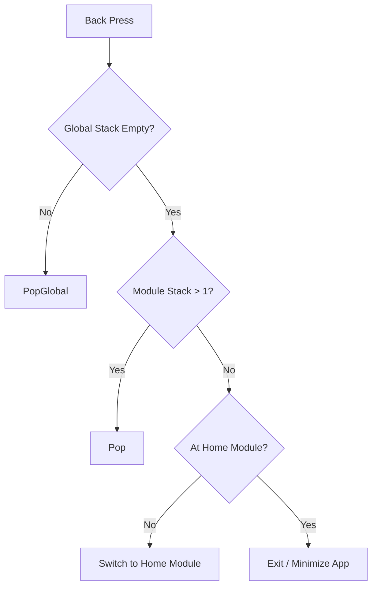

### 13.11 Module and Tab Relationship

Modules are the logical concept; Tabs are the UI representation:

```text
┌────────────────────────────────────────────────────────┐
│              Modules (Business Logic)                  │
│  ┌──────────┐ ┌──────────┐ ┌──────────┐ ┌──────────┐  │
│  │  home    │ │  search  │ │  orders  │ │ account  │  │
│  │  module  │ │  module  │ │  module  │ │  module  │  │
│  └────┬─────┘ └────┬─────┘ └────┬─────┘ └────┬─────┘  │
│       │            │            │            │         │
│       ▼            ▼            ▼            ▼         │
│  ┌──────────────────────────────────────────────────┐ │
│  │              Tab Bar (UI Layer)                   │ │
│  │   [Home]    [Search]   [Orders]   [Account]      │ │
│  └──────────────────────────────────────────────────┘ │
│                                                        │
│  ┌──────────────────────────────────────────────────┐ │
│  │  _global module (No Tab, Modal/Overlay only)     │ │
│  └──────────────────────────────────────────────────┘ │
└────────────────────────────────────────────────────────┘
```

### 13.12 Module and Runtime Coordination

Modules may span multiple runtimes:

```text
┌────────────────────────────────────────────────────────┐
│                   TabBar (Native)                      │
├──────────┬──────────┬──────────┬──────────┬───────────┤
│  Home    │  Search  │  Cart    │ Account  │   More    │
│  (RN)    │ (Native) │ (Flutter)│  (RN)    │ (WebView) │
└──────────┴──────────┴──────────┴──────────┴───────────┘
```

Coordination requirements:

- Tab bar is typically implemented in Native for consistent appearance
- Module switches trigger runtime visibility changes (show/hide, not destroy/create)
- Router Core coordinates which runtime container is visible
- Each runtime maintains its own stack state independently

### 13.13 Link Conversion System

The Router Core provides a **three-layer link system** for converting between internal
navigation and external URLs:

```text
┌─────────────────────────────────────────────────────────────────────┐
│                         Developer API                               │
│  router.navigate({ module: MODULE.HOME, path: "/products/123" })   │
└─────────────────────────────────────────────────────────────────────┘
                                  │
                                  ▼
┌─────────────────────────────────────────────────────────────────────┐
│                     NavRequest (Internal)                           │
│  { module: "home", path: "/products/123", params: {...} }          │
└─────────────────────────────────────────────────────────────────────┘
                                  │
                    ┌─────────────┴─────────────┐
                    ▼                           ▼
┌─────────────────────────────┐   ┌─────────────────────────────────┐
│    Internal URI (Debug)     │   │      External Links (Share)     │
│  home://products/123        │   │                                 │
└─────────────────────────────┘   │  Universal Link:                │
                                  │  https://myapp.com/products/123 │
                                  │                                 │
                                  │  URL Scheme:                    │
                                  │  myapp://products/123           │
                                  └─────────────────────────────────┘
```

### 13.14 LinkResolver Service

```text
interface LinkResolver {
    // External URL → NavRequest (for deep linking)
    parse(url: String): NavRequest | null;

    // NavRequest → External URL (for sharing)
    generate(request: NavRequest, format: LinkFormat): String;

    // Check if URL can be handled
    canHandle(url: String): bool;
}

enum LinkFormat {
    INTERNAL_URI,      // home://products/123
    UNIVERSAL_LINK,    // https://myapp.com/products/123
    URL_SCHEME,        // myapp://products/123
}
```

### 13.15 Route Link Configuration

Routes define their external link mappings:

```text
RouteDefinition {
    path: "/products/:id",
    name: "product.detail",

    // External link configuration
    externalLinks: {
        universalLink: {
            pattern: "https://myapp.com/products/{id}",
            aliases: [
                "https://myapp.com/p/{id}",
                "https://m.myapp.com/item/{id}",
            ],
        },
        urlScheme: {
            pattern: "myapp://products/{id}",
        },
    },

    // Deep link behavior
    deepLinkConfig: {
        defaultModule: "home",      // Which module to open in
        stackBehavior: ClearToRootAndPush,
    },
}
```

### 13.16 Link API Examples

```text
// Generate shareable link
const shareUrl = router.generateLink({
    module: MODULE.HOME,
    path: "/products/123",
    params: { utm_source: "share", share_by: userId },
    format: LinkFormat.UNIVERSAL_LINK,
});
// → "https://myapp.com/products/123?utm_source=share&share_by=xxx"

// Generate URL scheme
const schemeUrl = router.generateLink({
    module: MODULE.HOME,
    path: "/products/123",
    format: LinkFormat.URL_SCHEME,
});
// → "myapp://products/123"

// Parse incoming deep link
const request = router.parseLink("https://myapp.com/products/123?from=ad");
// → NavRequest { module: "home", path: "/products/123", params: { from: "ad" } }

// Handle deep link (called by system)
AppDelegate.onOpenUrl(url) {
    const request = router.parseLink(url);
    if (request) {
        router.navigate(request);
    }
}
```

### 13.17 Complete Link Flow

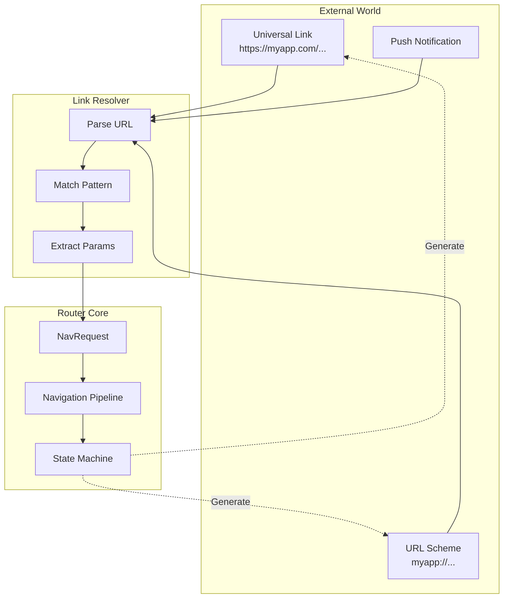

### 13.18 Module State Persistence

Module stacks should be included in state persistence:

```text
PersistableModuleState {
    active_module: ModuleId,
    module_stacks: Map<ModuleId, Vec<PersistableRoute>>,
    // Badge state typically not persisted (dynamic data)
}
```

---

## 14. State Restoration (Optional)

> **Note**: This feature is **optional** and may not be suitable for all applications.
> State restoration adds complexity and requires careful consideration of what state
> should and should not be persisted.

### 14.1 Overview

Mobile applications may be terminated by the system at any time (memory pressure, user action,
system updates). State restoration allows the Router Core to persist navigation state and
restore it when the app relaunches.

### 14.2 When to Use

| Scenario                             | Recommendation        |
| ------------------------------------ | --------------------- |
| Simple apps with shallow navigation  | Not needed            |
| Apps with complex multi-step flows   | Consider enabling     |
| Apps with sensitive/transient pages  | Selective restoration |
| Apps requiring fresh state on launch | Disable               |

### 14.3 Persistable State Model

```text
PersistableRouterState {
    version: u32,                    // For migration
    timestamp: i64,                  // When persisted

    // Tab state (if applicable)
    tab_container: Option<PersistableTabContainer>,

    // Stack state
    stacks: Map<Runtime, Vec<PersistableRoute>>,
    active_runtime: Runtime,

    // NOT persisted: pending transitions, animation state, transient data
}

PersistableRoute {
    name: RouteName,
    path: String,
    params: JsonValue,               // Only serializable params
    restorable: bool,                // Route-level opt-out
}
```

### 14.4 Route-Level Configuration

Routes can configure their restoration behavior:

```text
RouteDefinition {
    name: "payment.checkout",
    // ...

    restoration: RestorationConfig {
        // Whether this route can be restored
        restorable: false,           // Payment pages should not restore

        // Alternative route if restoration skipped
        fallback_route: Some("orders.list"),

        // Parameters to exclude from persistence (sensitive data)
        excluded_params: ["card_number", "cvv", "otp"],

        // Maximum age for this route's restoration
        max_age: Duration::hours(1),
    }
}
```

### 14.5 Persistence Triggers

```text
PersistTrigger {
    // Persist when app goes to background
    OnBackground,

    // Persist after each navigation (higher overhead)
    OnNavigation,

    // Persist periodically
    Periodic(Duration),

    // Persist only for specific routes
    OnCriticalRoute,
}

// Recommended: OnBackground with debounce
PersistenceConfig {
    trigger: OnBackground,
    debounce: Duration::millis(500),
    max_stack_depth: 10,             // Limit persisted stack size
    storage: SecureStorage,          // Platform-specific
}
```

### 14.6 Restoration Flow

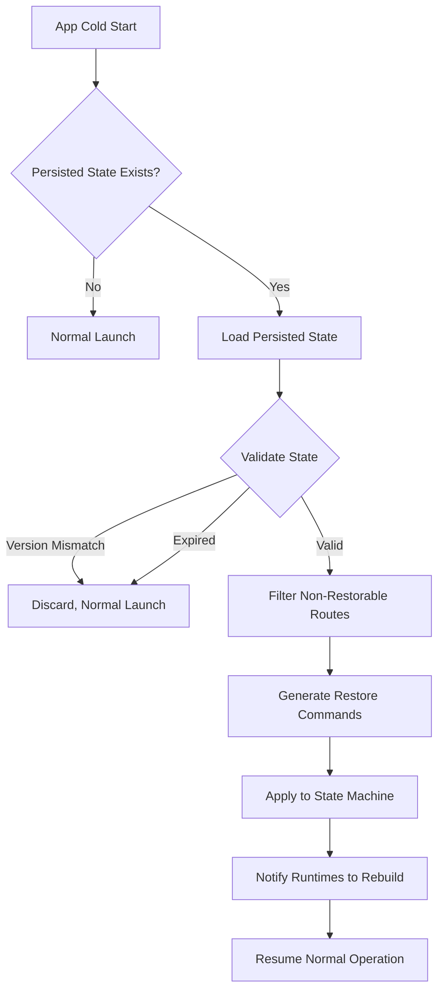

### 14.7 Restoration Algorithm

```text
fn restore_state(persisted: PersistableRouterState) -> Result<(), RestoreError> {
    // 1. Version check
    if persisted.version != CURRENT_VERSION {
        return Err(VersionMismatch);
    }

    // 2. Expiry check
    if now() - persisted.timestamp > MAX_STATE_AGE {
        return Err(StateExpired);
    }

    // 3. Filter routes
    let filtered_stacks = persisted.stacks.map(|stack| {
        stack.filter(|route| {
            let def = RouteRegistry.get(route.name);
            def.restoration.restorable &&
            !route.is_expired(def.restoration.max_age)
        })
        .map(|route| {
            // Remove excluded params
            route.filter_params(def.restoration.excluded_params)
        })
    });

    // 4. Handle empty stacks (fallback to root)
    let final_stacks = filtered_stacks.map(|stack| {
        if stack.is_empty() {
            vec![get_root_route()]
        } else {
            stack
        }
    });

    // 5. Apply to state machine
    StateMachine.restore(final_stacks);

    Ok(())
}
```

### 14.8 Persistence Middleware

A RO Middleware can trigger persistence after navigation:

```text
StatePersistenceMiddleware {
    fn on_post(ctx: &NavContext, result: &NavResult) {
        if self.config.trigger == OnNavigation {
            // Async persistence to avoid blocking
            spawn_async(|| {
                let state = Router.get_persistable_state();
                Storage.persist(state);
            });
        }
    }
}
```

### 14.9 Limitations and Considerations

1. **Page-level state is NOT restored** — Only navigation stack is restored; page data (forms,
   scroll position) must be handled by each runtime separately.

2. **Transient routes should opt-out** — Payment, authentication, and time-sensitive flows
   should set `restorable: false`.

3. **Deep links may conflict** — If app is restored AND has a pending deep link, deep link
   typically takes precedence.

4. **Testing complexity** — State restoration adds edge cases that require thorough testing.

5. **Storage security** — Persisted state may contain sensitive route parameters; use secure
   storage and exclude sensitive fields.

---

## 15. Discussion

### 15.1 Design Trade-offs

1. **Global Source of Truth vs Runtime Autonomy**  
   Ensures consistency at the cost of slightly increased routing latency.

2. **Middleware Rigidity vs Flexibility**  
   Protected RW middleware ensures safety but restricts certain advanced flows.

3. **Canonical Param Merging**  
   Greatly simplifies validation, but introduces upfront decode overhead.

4. **Deep Linking Pre-Pipeline Resolution**  
   Separating URL resolution from the middleware pipeline ensures clean URL-to-route mapping,
   but requires maintaining two configuration points (route definition + deep link patterns).

5. **Tab Navigation State Complexity**  
   Supporting independent per-tab stacks increases state management complexity but provides
   the expected mobile UX pattern.

6. **Optional State Restoration**  
   Making restoration optional acknowledges that not all apps benefit from it, but requires
   apps that need it to opt-in and carefully configure which routes are restorable.

### 15.2 Limitations

- Animated transitions remain runtime-dependent.
- Large Body payloads incur decode cost.
- Tab bar UI implementation is outside Router Core scope (handled by Native).
- State restoration does not cover page-internal state (forms, scroll position).
- Deferred deep linking requires third-party SDK integration.

---

## 16. Future Work

- Pluggable animation engines
- Transactional navigation model
- Predictive state computation
- Multi-device synchronized navigation
- Dynamic runtime loading
- Static route optimization
- Schema-based autogeneration of navigation forms

---

## 17. Conclusion

This RFC defines a complete, unified navigation architecture intended for multi-runtime mobile
and hybrid applications. The Router Core ensures deterministic navigation semantics, consistent
parameter behavior, a robust middleware pipeline, validated lifecycle, and isolated runtime
execution. This creates a predictable and extensible foundation for complex, modular, modern
applications.
