# 统一多运行时路由核心 RFC

## 摘要

本 RFC 详细描述了统一多运行时路由核心（Unified Multi‑Runtime Router Core）的设计与行为规范。该路由核心是一个导航协调系统，专为由多种 UI 运行时（包括 Native iOS/Android、React Native、Flutter 和 WebView）组成的应用程序设计。Router Core 提供了一个统一的模型，涵盖路由、参数、状态转换、中间件、生命周期事件以及跨异构环境的动画集成。

## 1. 引言

现代移动应用程序越来越多地采用多运行时架构，以平衡灵活性、性能和开发者生产力。原生页面与 React Native 模块、Flutter 引擎，有时还有嵌入式 WebView 共存。然而，跨这些运行时的导航仍然是碎片化的。每个运行时都暴露自己的栈、自己的路由语义和自己的生命周期行为。

本 RFC 提出一个统一的 Router Core，作为所有运行时导航状态和行为的唯一真实来源。

## 2. 问题定义

### 2.1 碎片化的导航模型

不同的 UI 运行时实现了不兼容的导航语义：

- **iOS/Android 原生**：视图控制器/活动，具有操作系统级别的堆栈规则。
- **React Native**：JavaScript 驱动的路由，独立于原生 VC 栈。
- **Flutter**：Navigator + 自定义引擎，各自维护隔离的栈。
- **WebView**：类浏览器的历史记录机制。

这种异构性导致状态不一致、所有权不明确以及跨运行时转换困难。

### 2.2 参数传递不一致

各运行时使用不同的格式：

- Native → 强类型结构体
- React Native → JSON
- Flutter → Dart 对象
- WebView → URL + 消息传递

没有统一的机制来确保：

- 验证
- 类型安全
- 参数模式一致性

### 2.3 缺乏统一的生命周期系统

导航涉及多个阶段：

- 路由前
- 参数验证
- 状态转换
- 动画开始
- 动画结束

现有系统缺乏一个跨所有运行时的单一、连贯的模型。

### 2.4 缺乏可扩展的中间件架构

路由关注点通常包括：

- 认证
- 日志记录
- 动态实验
- 多租户规则

当前运行时特定的方法既不可组合也不能全局强制执行。

### 2.5 没有全局真实来源

每个运行时都维护自己的导航状态，导致：

- 分歧
- 重复逻辑
- 不可预测的行为
- 难以调试

---

## 3. 设计概述

Router Core 通过作为以下方面的**中央权威**来统一所有运行时的导航：

- 路由解析
- 参数合并与验证
- 中间件处理
- 跨运行时状态转换
- 向每个运行时发送命令
- 生命周期（钩子）
- 动画事件

高层架构如下图所示。

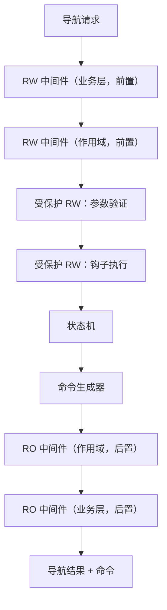

### 3.1 核心原则

1. **单一真实来源**
   Router Core 维护一个全局的、权威的导航状态。

2. **运行时无关**
   命令抽象了 Native / RN / Flutter / WebView 的行为。

3. **确定性管道**
   导航流经固定的中间件序列。

4. **保护层**
   参数验证 + 钩子执行不能被绕过。

5. **跨运行时保证**
   无论 UI 引擎如何，导航状态必须保持一致。

---

## 4. 路由模型

### 4.1 概述

Router Core 引入了一个受后端路由系统启发的**树状结构路由模型**。路由按层次组织以反映业务领域和命名空间：

- `/account/profile`
- `/account/security`
- `/orders/:orderId/detail`

每个路由在启动时加载的静态**路由树**中表示为一个节点。

### 4.2 路由树结构

一个路由由以下部分组成：

- **路径段**
  - 静态（`"account"`）
  - 参数化（`":orderId"`）
  - 通配符（`"*"`，`"**"`）
- **路由元数据**（仅叶节点）
  - 名称（`"account.profile"`）
  - 运行时类型
  - 参数模式
  - 中间件绑定
  - 钩子配置（通过核心中间件执行）

### 4.3 路由树图示

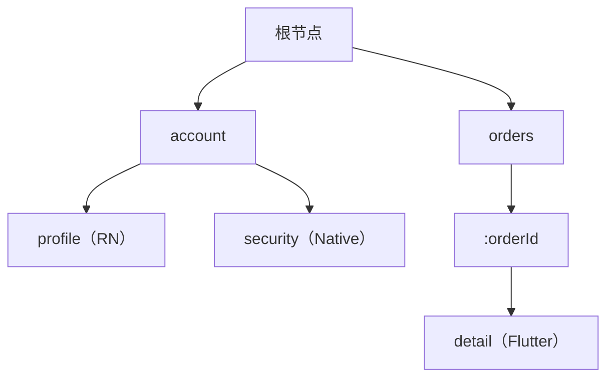

### 4.4 解析模式

路由可以通过以下方式解析：

1. **基于名称的解析**

   ```
   account.profile
   orders.detail
   ```

2. **基于路径的解析**
   ```
   /orders/123/detail
   /account/profile
   ```

### 4.5 解析算法

给定一个 `NavRequest`：

1. 如果是 `ByName`，直接查找元数据。
2. 如果是 `ByPath`，遍历路由树：
   - 匹配每个段
   - 捕获路径参数
   - 确保匹配在叶节点结束

### 4.6 解析流程

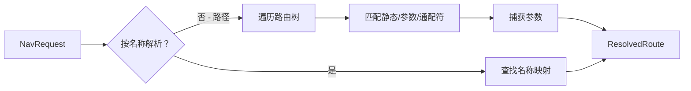

### 4.7 ResolvedRoute

解析后的路由包括：

- 叶路由的元数据
- 完整的规范化路径
- 路径参数
- 祖先节点（用于子树中间件继承）

### 4.8 命名空间和业务隔离

命名空间自然映射到顶级路由段：

- `account.…`
- `orders.…`
- `settings.…`

这使得以下成为可能：

- 业务级别的分离
- 作用域中间件
- 模块化团队所有权
- 清晰的导航边界

---

## 5. 参数模型

### 5.1 概述

Router Core 支持**两个互补的参数通道**，模仿 HTTP 语义：

1. **查询参数** — 始终为字符串
2. **Body 参数** — 任意结构化数据（通过可插拔编解码器）

这些被合并成一个统一的**规范参数模型**，供 Router Core、中间件、钩子和运行时使用。

### 5.2 查询参数

查询参数是直接在导航请求中传递的轻量级键值对。它们：

- 必须是字符串
- 保持顺序
- 适合短小的、类 URL 的标志

示例：

```
?tab=profile&source=notification
```

### 5.3 Body 参数

Body 参数是用于以下目的的编码负载：

- 丰富的数据（对象、数组）
- 类型化信息
- 大型结构化输入

Body 支持多种编解码器：

- JSON（默认）
- Protobuf
- MsgPack
- CBOR（可选）
- 通过注册表的自定义编解码器

### 5.4 编解码器注册表

Router Core 包含一个可插拔的 **CodecRegistry**：

```text
JSONCodec      → application/json
ProtobufCodec  → application/x-protobuf
MsgPackCodec   → application/msgpack
...
```

注册表映射 `content_type → 解码器`。

### 5.5 规范参数

Router Core 将两个通道合并成一个**规范 JSON 对象**：

```
CanonicalParams {
    query:   Map<String, String>,
    body:    JsonValue,     // 从编解码器解码
    merged:  JsonValue      // 传递给验证和钩子的统一视图
}
```

### 5.6 合并规则

1. 查询参数在 `query` 下成为字符串。
2. Body 被解码为 `JSON`。
3. `merged` 通过以下方式产生：
   - 浅合并
   - **body 优先**于 query

示例：

```
Query:  { "id": "123", "mode": "view" }
Body:   { "mode": "edit", "user": { "name": "A" } }

Merged:
{
  "id": "123",
  "mode": "edit",
  "user": { "name": "A" }
}
```

### 5.7 规范流程图

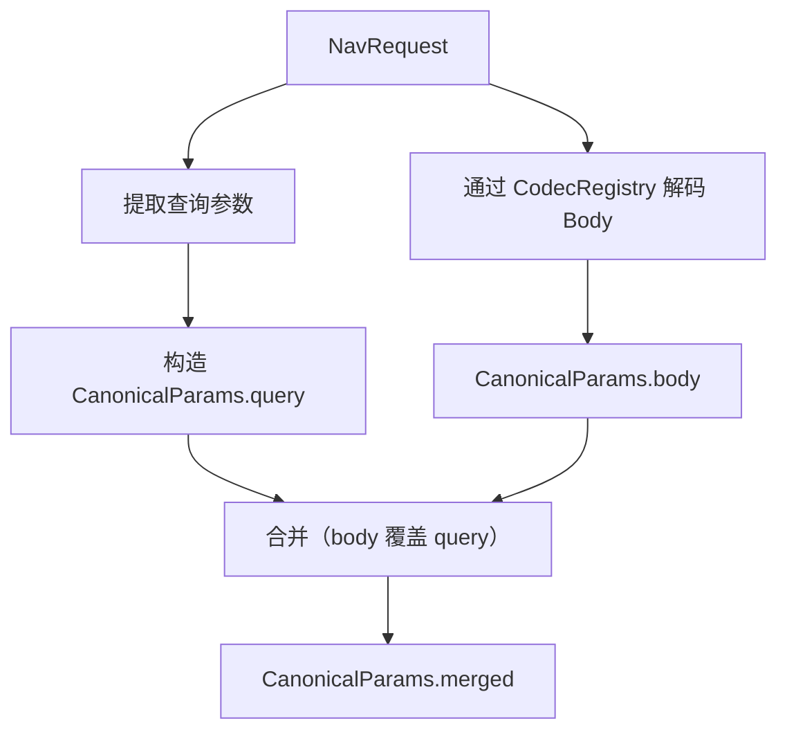

### 5.8 规范模型的动机

- 中间件获得稳定的结构化输入
- Schema 验证在单个 JSON 对象上操作
- 钩子接收统一的语义参数
- 所有运行时（Native/RN/Flutter/WebView）都可以确定性地重建结构化输入

### 5.9 验证就绪

CanonicalParams 直接传递给：

- **CoreParamValidationMiddleware**
- 定义的 JSON Schema
- 钩子执行上下文

确保参数表面是：

- 可预测的
- 已验证的
- 运行时无关的
- 类型一致的

---

## 6. 中间件系统

### 6.1 概述

Router Core 定义了一个统一的**中间件管道**，所有导航请求都必须通过它。中间件提供了一种结构化、可组合的方式来引入横切关注点逻辑，如认证、日志记录、多租户规则或动态路由约束。

本 RFC 中的中间件分为：

- **业务中间件（可定制）**
- **核心中间件（内置且强制）**
- **后处理中间件（只读）**

这些共同形成一个确定性且可扩展的管道。

### 6.2 中间件执行模型

中间件接收：

- 当前的 `NavRequest`
- `ResolvedRoute`
- `CanonicalParams`
- 路由器状态快照（前/后）
- 决策能力：
  - 继续
  - 修改请求（仅 RW）
  - 重定向（仅 RW）
  - 取消（仅 RW）
  - 观察（仅 RO）

### 6.3 标准中间件流程

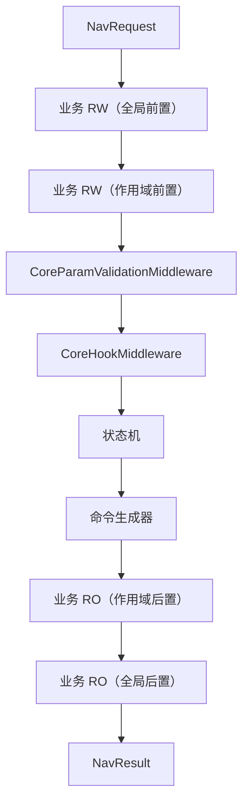

### 6.4 核心中间件

#### 6.4.1 CoreParamValidationMiddleware

执行：

- JSON Schema 验证
- 结构检查
- 必填字段验证

它确保：

- 无效的导航无法继续
- 没有运行时接收到格式错误的参数

#### 6.4.2 CoreHookMiddleware

执行生命周期钩子：

- BeforeValidate
- BeforeCommit
- AfterCommitBeforeAnimation
- OnAnimationStart
- OnAnimationEnd

钩子**不直接运行**，而是通过这个核心中间件层调用。

### 6.5 业务中间件

业务中间件可能包括：

- 认证
- 租户隔离
- 日志记录
- 实验路由
- 功能开关
- 动态访问控制

业务中间件专门插入：

- 核心验证逻辑之前（RW）
- 命令生成之后（RO）

### 6.6 中间件顺序保证

1. 业务 RW 中间件总是在核心验证**之前**运行。
2. 核心中间件总是按**固定顺序**执行。
3. 业务 RO 中间件总是在命令生成**之后**运行。
4. 没有中间件可以绕过核心逻辑。

### 6.7 管道不可变性

Router Core 强制执行：

- 中间件顺序
- 核心中间件不可移除性
- RW → 受保护 → RO 区域之间的安全转换

这防止了业务逻辑无意中破坏导航行为。

---

## 7. 中间件级别（RO / RW / 受保护 RW）

### 7.1 概述

为确保安全性、可预测性和可扩展性，中间件分为三个级别：

1. **RO – 只读**
2. **RW – 读写**
3. **受保护 RW – 核心读写（不可绕过）**

### 7.2 RO – 只读中间件

特征：

- 不能修改请求
- 不能阻止导航
- 不能重定向
- 用于：
  - 日志记录
  - 指标
  - 监控

在核心逻辑**之后**运行。

### 7.3 RW – 读写中间件

特征：

- 可以修改参数
- 可以取消导航
- 可以重定向
- 放置在核心逻辑**之前**
- 用于：
  - 认证
  - AB 测试
  - 多租户逻辑
  - 动态规则

### 7.4 受保护 RW 中间件

核心行为属于这里：

- 参数验证
- 钩子执行
- 内部状态转换

它们：

- **必须运行**
- **不能被移除**
- **不能被覆盖**
- 按固定顺序执行

### 7.5 中间件权限矩阵

| 级别      | 修改参数 | 取消 | 重定向 | 强制   | 控制者 |
| --------- | -------- | ---- | ------ | ------ | ------ |
| RO        | ❌       | ❌   | ❌     | 否     | 业务   |
| RW        | ✔️       | ✔️   | ✔️     | 否     | 业务   |
| 受保护 RW | ✔️       | ✔️   | ✔️     | **是** | 核心   |

### 7.6 转换流程

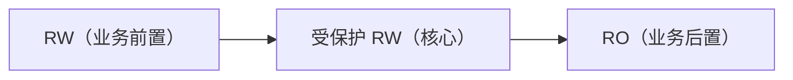

### 7.7 安全保证

- 业务逻辑不能跳过参数验证。
- 钩子不能被绕过。
- 命令生成始终一致。
- 可观察性（RO）不能影响路由行为。

---

## 8. 导航管道

### 8.1 概述

Router Core 定义了一个**确定性的、运行时无关的管道**，处理从发起到完成的每个导航请求。该管道确保：

- 可预测的路由行为
- 全局强制的验证
- 固定的顺序和副作用隔离
- 一致的状态转换
- 跨运行时的命令生成
- 统一的生命周期和错误语义

管道分为**八个主要阶段**。

---

### 8.2 管道阶段

#### **阶段 1 — 请求接收**

当任何运行时（Native、RN、Flutter、WebView）提交 `NavRequest` 时，管道开始。

输入：

- 原始请求（ByName / ByPath）
- 查询参数
- 编码的 body
- 元数据（来源运行时）

输出：

- 原始请求的不可变快照

---

#### **阶段 2 — 路由解析**

路由器识别目标叶路由：

- 基于名称的查找
- 或基于树的路径匹配

输出：

- `ResolvedRoute`
- 捕获的路径参数

错误：

- 未知路由
- 模糊的通配符匹配
- 缺少参数

---

#### **阶段 3 — 参数合并**

查询和 body 参数被统一到 `CanonicalParams` 对象中。

Body → 使用 `CodecRegistry` 解码。
Query → 字符串映射。
Merged → JSON 对象（body 覆盖 query）。

输出：

- CanonicalParams { query, body, merged }

---

#### **阶段 4 — 核心前业务中间件（RW）**

业务定义的 RW 中间件可以：

- 修改请求
- 阻止导航
- 重定向
- 附加元数据
- 强制执行业务规则（Auth、A/B、租户、实验）

输出：

- 可能被修改的请求
- 或重定向的请求（重启管道）
- 或取消

错误：

- 拒绝访问
- 规则违反

---

#### **阶段 5 — 受保护核心中间件**

1. **CoreParamValidationMiddleware**

   - 根据 JSON Schema 验证合并的参数
   - 拒绝格式错误的请求

2. **CoreHookMiddleware**
   - 执行生命周期钩子
   - 允许业务逻辑取消或重定向
   - 保证顺序

输出：

- 已验证的规范参数
- 钩子副作用结果

错误：

- 验证失败
- beforeCommit 钩子取消
- 重定向（重启管道）

---

#### **阶段 6 — 状态机**

中央状态机计算：

- 跨栈的转换
- 运行时边界
- push / pop / replace 语义
- 约束（根删除、空栈保护）

输出：

- 更新的 RouterState
- 转换描述符（from → to）

---

#### **阶段 7 — 命令生成器**

Router Core 将状态差异转换为抽象命令：

```
BeginTransition
AttachRuntime
PushRoute
PopRoute
ReplaceTop
EndTransition
```

命令被传递给：

- Native 适配器
- RN 适配器
- Flutter 适配器
- WebView 适配器

每个适配器为其运行时解释命令。

---

#### **阶段 8 — 核心后中间件（RO）**

只读中间件观察：

- 已解析的路由
- 规范参数
- 结果状态
- 发出的命令

用于：

- 日志记录
- 遥测
- 指标
- 曝光追踪

不能修改或阻止。

---

### 8.3 端到端序列图

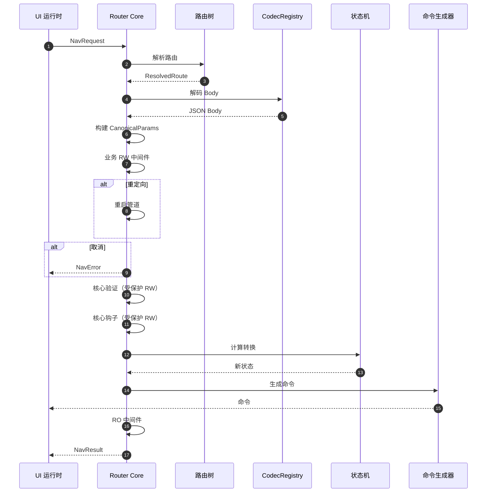

---

### 8.4 错误传播模型

错误传播为：

1. 业务 RW 中间件取消 → 立即 `NavError`。
2. 参数验证失败 → `InvalidParams`。
3. 钩子取消 → `HookDenied`。
4. 状态机违规 → `IllegalTransition`。
5. 编解码器失败 → `DecodeError`。

重定向使用新请求重启管道。

---

### 8.5 重定向模型

重定向是 RW 中间件和钩子的一部分：

- 构造新的 `NavRequest`
- 从阶段 1 重启管道
- 维护重定向计数器以防止循环

---

## 9. 状态机和命令

### 9.1 概述

Router Core 维护一个权威的 **RouterState**，表示：

- 一个或多个导航栈
- 每运行时的栈所有权
- 当前可见路由
- 待处理的转换

状态机确保导航是：

- 确定性的
- 跨运行时一致的
- 可逆的
- 可观察的

---

### 9.2 栈模型

每个运行时都有一个专用的逻辑栈：

```text
NativeStack
RNStack
FlutterStack
WebViewStack
```

同一时间只能有一个是活动的（可见的）。

---

### 9.3 状态转换类别

支持的转换包括：

- `Push`
- `Pop`
- `Replace`
- `RebuildStack`
- `SwitchRuntime`
  （当 push 属于另一个运行时的路由时隐式发生）

---

### 9.4 转换图

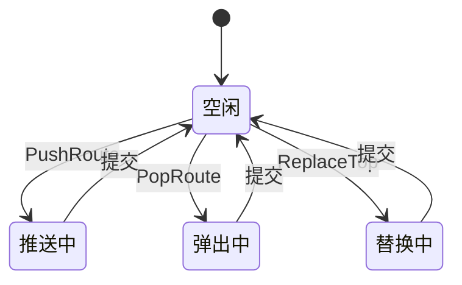

---

### 9.5 命令生成

命令生成将转换转换为运行时中立的指令：

```text
BeginTransition(id)
AttachRuntime(runtime)
PushRoute(route)
PopRoute
ReplaceTop(route)
EndTransition(id)
```

适配器将这些命令转换为：

- 视图控制器转换（iOS）
- activity/fragment 操作（Android）
- navigator 操作（Flutter）
- JS 导航分发（RN）

---

### 9.6 命令流程图

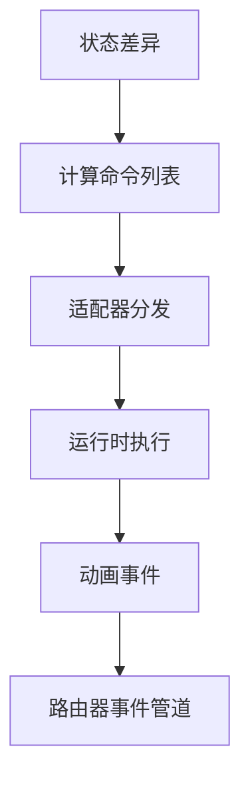

---

## 10. 运行时适配

### 10.1 概述

每个 UI 运行时（Native、React Native、Flutter、WebView）通过一个薄的、确定性的适配器层解释从 Router Core 发出的导航命令。这些适配器将抽象命令转换为运行时特定的操作，同时保持跨运行时的一致性。

### 10.2 适配器职责

- 维护 Router Core 和运行时引擎之间的绑定
- 按顺序执行导航命令
- 发出动画生命周期事件
- 报告运行时错误
- 保证运行时之间的隔离

### 10.3 适配器模型

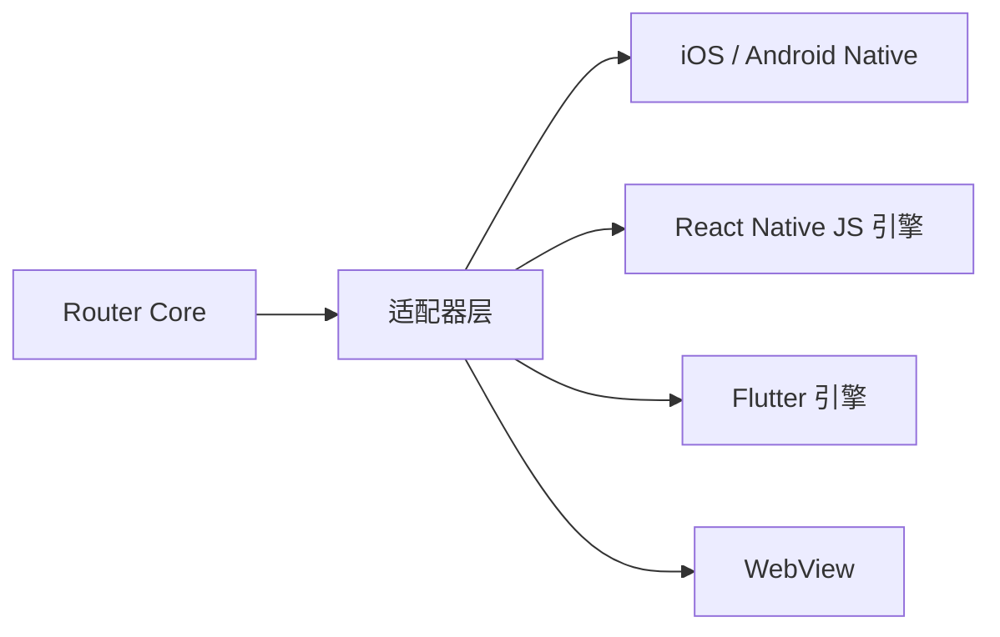

### 10.4 命令解释

| 命令                | Native            | RN                | Flutter          | WebView       |
| ------------------- | ----------------- | ----------------- | ---------------- | ------------- |
| PushRoute           | push VC           | JS stack push     | Navigator.push   | history.push  |
| PopRoute            | pop VC            | JS stack pop      | Navigator.pop    | history.back  |
| ReplaceTop          | replace VC        | replace           | pushReplacement  | replaceState  |
| AttachRuntime       | present VC        | activate RN root  | activate engine  | focus webview |
| Begin/EndTransition | transaction block | batched UI update | transition begin | N/A           |

### 10.5 隔离保证

- 运行时不操作彼此的栈。
- 命令是完全抽象的；适配器强制执行本地不变量。
- Router Core 维护全局顺序。

---

## 11. 动画事件模型

### 11.1 概述

动画在移动导航中至关重要，但在各运行时之间差异显著。
Router Core 引入了一个**统一的动画事件管道**。

### 11.2 动画阶段

- **TransitionStart**
- **AnimationStart**
- **AnimationEnd**
- **TransitionEnd**

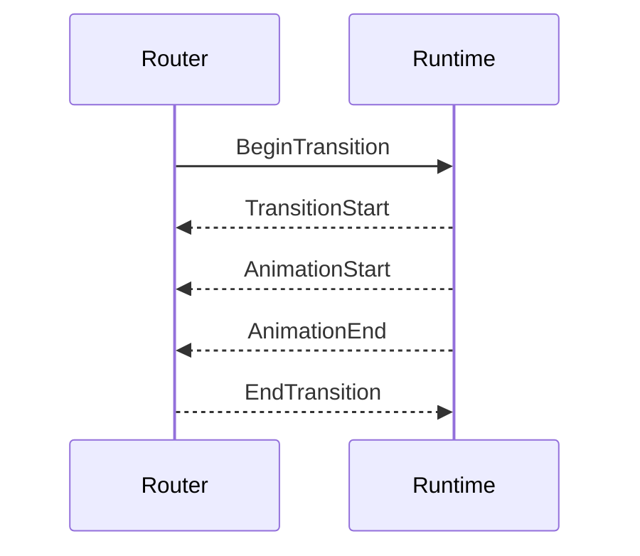

### 11.3 动画事件的目的

- 驱动钩子阶段
- 启用追踪和曝光报告
- 协调多运行时动画
- 确保动画后状态最终化

---

## 12. 深度链接（Deep Linking）

### 12.1 概述

深度链接允许从外部来源（其他应用、浏览器、推送通知、系统 URL）导航到应用内的特定路由。
与内部导航不同，深度链接必须在进入标准导航管道之前进行解析、验证和转换。

Router Core 提供**两阶段深度链接架构**：

1. **DeepLinkResolver** — URL 解析和路由匹配（管道前）
2. **DeepLinkMiddleware** — 业务逻辑处理（管道内）

### 12.2 深度链接流程

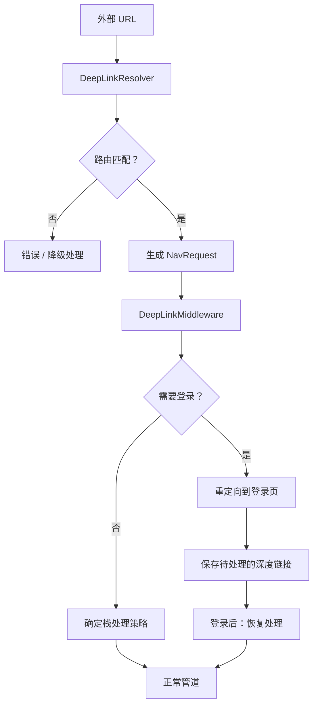

### 12.3 DeepLinkResolver

DeepLinkResolver 是一个**管道前组件**，将外部 URL 转换为 `NavRequest` 对象。

```text
DeepLinkResolver {
    // URL 模式到路由的映射
    patterns: Map<UrlPattern, RouteName>,

    // 提取路径和查询参数
    parse(url: String) -> Result<DeepLinkData, DeepLinkError>,

    // 从解析数据生成 NavRequest
    resolve(data: DeepLinkData) -> Result<NavRequest, DeepLinkError>,
}

DeepLinkData {
    matched_route: RouteName,
    path_params: Map<String, String>,
    query_params: Map<String, String>,
    source: DeepLinkSource,  // universal_link, app_link, scheme, push
    raw_url: String,
}
```

### 12.4 URL 模式配置

路由可以在定义中声明深度链接模式：

```text
RouteDefinition {
    name: "orders.detail",
    path: "/orders/:orderId/detail",
    runtime: Flutter,

    deep_link: DeepLinkConfig {
        patterns: [
            "https://myapp.com/orders/{orderId}",
            "https://myapp.com/o/{orderId}",
            "myapp://orders/{orderId}",
        ],
        requires_auth: true,
        stack_behavior: ClearToRootAndPush,
    }
}
```

### 12.5 DeepLinkMiddleware

DeepLinkMiddleware 是一个 **RW 中间件**，处理深度链接特有的业务逻辑：

```text
DeepLinkMiddleware {
    fn on_pre(ctx: &mut NavContext) -> MiddlewareResult {
        if !ctx.is_deep_link() {
            return Continue;
        }

        // 1. 检查是否需要认证
        if ctx.route.requires_auth && !ctx.is_authenticated() {
            return Redirect(LoginRoute, pending: ctx.request);
        }

        // 2. 应用栈处理策略
        ctx.set_stack_behavior(ctx.route.deep_link.stack_behavior);

        // 3. 追踪深度链接分析
        Analytics::track_deep_link(ctx.deep_link_data);

        Continue
    }
}
```

### 12.6 栈处理策略

当深度链接到达时，Router Core 必须决定如何将目标路由集成到现有导航栈中：

| 策略                 | 行为                     | 使用场景             |
| -------------------- | ------------------------ | -------------------- |
| `Push`               | 在当前栈上推入           | 保留用户的导航上下文 |
| `ClearAndPush`       | 清空栈，推入目标         | 深度链接的全新开始   |
| `ClearToRootAndPush` | 弹出到根，然后推入       | 保持根页面但清除历史 |
| `PopToIfExists`      | 如果在栈中则弹出到该路由 | 避免重复路由         |

### 12.7 冷启动 vs 热启动

深度链接的行为取决于应用状态：

| 场景                   | 处理方式                                                          |
| ---------------------- | ----------------------------------------------------------------- |
| **冷启动**             | App 初始化 → Router Core 加载 → 解析待处理的深度链接 → 应用栈策略 |
| **热启动（后台唤醒）** | Router Core 已激活 → 立即处理深度链接                             |
| **前台运行中**         | 作为带有深度链接元数据的普通导航处理                              |

```text
ColdStartHandler {
    pending_deep_link: Option<String>,

    fn on_router_ready() {
        if let Some(url) = pending_deep_link {
            Router.handle_deep_link(url);
        }
    }
}
```

### 12.8 延迟深度链接（Deferred Deep Linking）

用于点击链接后才安装应用的用户（通过应用商店）：

```text
DeferredDeepLink {
    url: String,
    source: String,           // 活动、推荐来源
    timestamp: i64,
    expiry: Duration,         // 通常 24-48 小时
}

// 通常通过第三方 SDK 实现（Branch、AppsFlyer、Adjust）
// Router Core 提供集成钩子
DeferredDeepLinkHandler {
    fn on_first_launch() -> Option<DeferredDeepLink>,
    fn apply(link: DeferredDeepLink) -> NavRequest,
}
```

### 12.9 深度链接错误处理

```text
DeepLinkError {
    UnknownRoute,           // 没有匹配的模式
    InvalidParameters,      // 缺少必需参数
    Expired,               // 延迟链接已过期
    AuthenticationRequired, // 用户未登录
    PermissionDenied,      // 用户缺少访问权限
}

// 降级行为配置
DeepLinkFallback {
    on_unknown_route: FallbackAction,     // ShowError | GoHome | OpenBrowser
    on_auth_required: FallbackAction,     // GoLogin | ShowError
    on_permission_denied: FallbackAction, // ShowError | GoHome
}
```

---

## 13. 模块系统与导航 API

### 13.1 概述

Router Core 引入了**基于模块的架构**，模块作为组织导航栈的一等命名空间。
这种设计将路由定义与其显示上下文解耦，使同一路由可以被推入任何模块的栈中，无需重复注册。

核心概念：

- **Module（模块）**：拥有导航栈的命名空间（类似于"域名"）
- **Route（路由）**：页面定义，全局唯一且与模块无关
- **Tab**：模块的 UI 表现形式（可选，模块可以没有 Tab）

### 13.2 为什么使用模块作为命名空间

传统设计将 Tab 耦合在路由路径中：

```text
// 传统设计：路由重复问题
/home/products/:id      → ProductDetail
/search/products/:id    → ProductDetail  // 重复！
/favorites/products/:id → ProductDetail  // 重复！
```

基于模块的设计分离关注点：

```text
// 模块设计：路由只注册一次
RouteRegistry {
    products/:id → ProductDetail  // 单次注册
}

// 导航时指定目标模块
home://products/123      // 推入 home 栈
search://products/123    // 推入 search 栈
favorites://products/123 // 推入 favorites 栈
```

### 13.3 模块定义

```text
ModuleDefinition {
    id: ModuleId,              // "home", "search", "account"
    name: String,              // 显示名称
    rootPath: String,          // 根路由路径
    runtime: Runtime,          // 哪个运行时渲染此模块

    // 可选：Tab 配置（如果模块出现在 Tab 栏中）
    tab: Option<TabConfig> {
        index: u32,            // Tab 栏位置
        icon: IconResource,
        badge: Option<Badge>,
    },
}

// 特殊模块
MODULE._global    // 用于 Modal/覆盖层，无 Tab 表示
MODULE.home       // 通常是默认/主模块
```

### 13.4 路由与模块的关系

路由是**全局唯一**且**与模块无关**的：

```text
RouteDefinition {
    path: "/products/:id",
    name: "product.detail",
    runtime: Runtime.Flutter,

    // 路由不指定属于哪个模块
    // 它们可以被推入任何模块的栈中
}
```

### 13.5 扩展的状态模型

```text
RouterState {
    // 模块栈（module_id → 导航栈）
    module_stacks: Map<ModuleId, Vec<Route>>,

    // 当前活跃模块
    active_module: ModuleId,

    // 全局栈，用于 Modal（在所有模块之上）
    global_stack: Vec<Route>,

    // 活跃运行时
    active_runtime: Runtime,
}
```

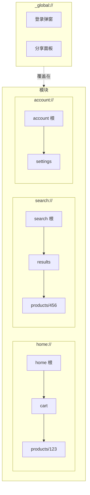

### 13.6 导航 API 设计

Router Core 提供**结构化、类型安全的 API**，而非基于字符串的 URI：

```text
// 模块枚举（类型安全）
enum MODULE {
    HOME = "home",
    SEARCH = "search",
    ACCOUNT = "account",
    ORDERS = "orders",
    _GLOBAL = "_global",
}

// 导航 API
interface NavigationAPI {
    navigate(options: NavOptions): Promise<NavResult>;
    push(path: String, module?: MODULE): Promise<NavResult>;
    pop(): Promise<NavResult>;
    replace(options: NavOptions): Promise<NavResult>;
    switchModule(module: MODULE): Promise<NavResult>;
    popToRoot(): Promise<NavResult>;
}

NavOptions {
    module?: MODULE,          // 目标模块（默认：当前模块）
    path: String,             // 路由路径
    params?: Map<String, Any>,// Query 参数
    body?: Any,               // Body 参数
    options?: {
        animated: bool,
        presentation: Presentation,  // push | modal | replace
    }
}
```

### 13.7 导航示例

```text
// 在当前模块内导航
router.navigate({
    path: "/products/123",
    params: { from: "banner" }
});

// 导航到指定模块
router.navigate({
    module: MODULE.SEARCH,
    path: "/results",
    params: { query: "phone" }
});
// 内部处理：切换到 search 模块 + 推入 /results

// 打开全局 Modal
router.navigate({
    module: MODULE._GLOBAL,
    path: "/login",
});

// 便捷方法
router.push("/products/123");                  // 当前模块
router.push("/products/123", MODULE.HOME);    // 指定模块
router.switchModule(MODULE.ORDERS);            // 仅切换模块
router.pop();                                  // 当前栈弹出
router.popToRoot();                            // 弹出到模块根
```

### 13.8 内部 URI 表示

内部导航请求以 URI 形式表示，用于日志、调试和序列化：

```text
// 内部 URI 格式
{module}://{path}?{query}

// 示例
home://products/123?from=banner
search://results?query=phone
_global://login
account://settings/security

// NavRequest ↔ URI 转换
NavRequest {
    module: "home",
    path: "/products/123",
    params: { from: "banner" }
}
↔ "home://products/123?from=banner"
```

### 13.9 模块导航命令

```text
NavCommand {
    // 栈命令
    Push { module: ModuleId, route: Route },
    Pop { module: ModuleId },
    Replace { module: ModuleId, route: Route },
    PopToRoot { module: ModuleId },

    // 模块命令
    SwitchModule { module: ModuleId, reset_stack: bool },

    // 全局栈命令
    PushGlobal(Route),
    PopGlobal,

    // Badge 更新
    UpdateBadge { module: ModuleId, badge: Option<Badge> },
}
```

### 13.10 返回按钮行为

```text
fn handle_back_press() -> BackResult {
    // 1. 首先检查全局栈
    if global_stack.len() > 0 {
        return PopGlobal;
    }

    // 2. 检查当前模块的栈
    let current_stack = module_stacks[active_module];
    if current_stack.len() > 1 {
        return Pop;
    }

    // 3. 在模块根页面 - 检查是否应该切换模块
    if active_module != home_module {
        return SwitchModule(home_module);
    }

    // 4. 在首页模块根页面 - 退出或最小化
    return ExitApp;
}
```

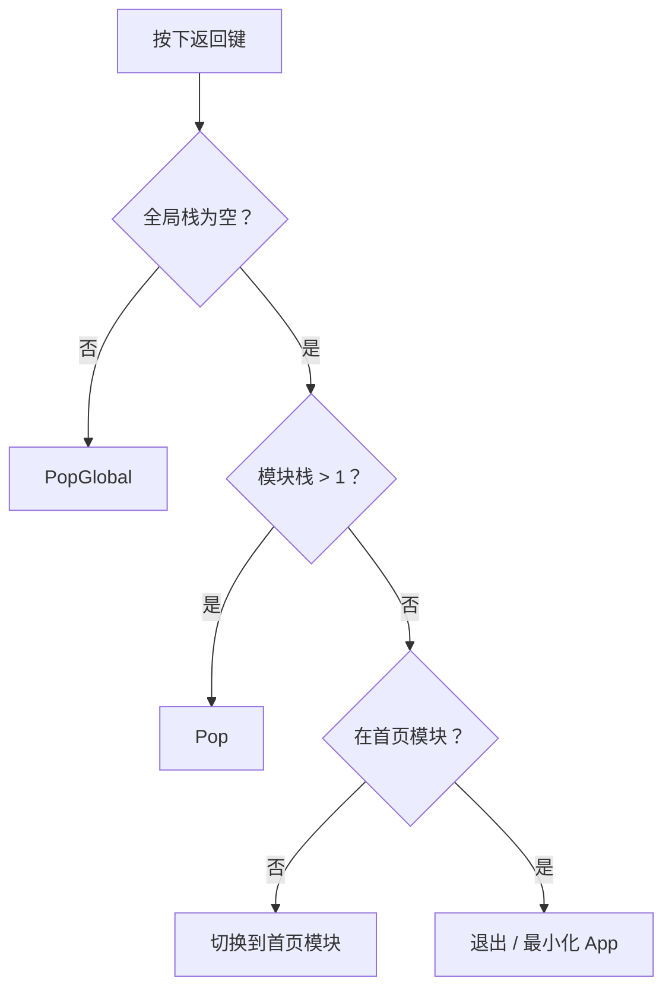

### 13.11 模块与 Tab 的关系

模块是逻辑概念；Tab 是 UI 表现形式：

```text
┌────────────────────────────────────────────────────────┐
│              模块（业务逻辑层）                          │
│  ┌──────────┐ ┌──────────┐ ┌──────────┐ ┌──────────┐  │
│  │  home    │ │  search  │ │  orders  │ │ account  │  │
│  │  模块    │ │  模块    │ │  模块    │ │  模块    │  │
│  └────┬─────┘ └────┬─────┘ └────┬─────┘ └────┬─────┘  │
│       │            │            │            │         │
│       ▼            ▼            ▼            ▼         │
│  ┌──────────────────────────────────────────────────┐ │
│  │              Tab 栏（UI 层）                       │ │
│  │   [首页]    [搜索]    [订单]    [我的]            │ │
│  └──────────────────────────────────────────────────┘ │
│                                                        │
│  ┌──────────────────────────────────────────────────┐ │
│  │  _global 模块（无 Tab，仅用于 Modal/覆盖层）       │ │
│  └──────────────────────────────────────────────────┘ │
└────────────────────────────────────────────────────────┘
```

### 13.12 模块与运行时协调

模块可能跨越多个运行时：

```text
┌────────────────────────────────────────────────────────┐
│                   TabBar（Native）                      │
├──────────┬──────────┬──────────┬──────────┬───────────┤
│   首页   │   搜索   │  购物车  │   我的   │   更多    │
│   (RN)   │ (Native) │ (Flutter)│   (RN)   │ (WebView) │
└──────────┴──────────┴──────────┴──────────┴───────────┘
```

协调要求：

- Tab 栏通常由 Native 实现以保持一致的外观
- 模块切换触发运行时可见性变化（显示/隐藏，而非销毁/创建）
- Router Core 协调哪个运行时容器可见
- 每个运行时独立维护自己的栈状态

### 13.13 链接转换系统

Router Core 提供**三层链接系统**，用于在内部导航和外部 URL 之间转换：

```text
┌─────────────────────────────────────────────────────────────────────┐
│                         开发者 API                                   │
│  router.navigate({ module: MODULE.HOME, path: "/products/123" })    │
└─────────────────────────────────────────────────────────────────────┘
                                  │
                                  ▼
┌─────────────────────────────────────────────────────────────────────┐
│                     NavRequest（内部）                               │
│  { module: "home", path: "/products/123", params: {...} }           │
└─────────────────────────────────────────────────────────────────────┘
                                  │
                    ┌─────────────┴─────────────┐
                    ▼                           ▼
┌─────────────────────────────┐   ┌─────────────────────────────────┐
│    内部 URI（调试用）        │   │      外部链接（分享用）          │
│  home://products/123        │   │                                 │
└─────────────────────────────┘   │  Universal Link:                │
                                  │  https://myapp.com/products/123 │
                                  │                                 │
                                  │  URL Scheme:                    │
                                  │  myapp://products/123           │
                                  └─────────────────────────────────┘
```

### 13.14 LinkResolver 服务

```text
interface LinkResolver {
    // 外部 URL → NavRequest（用于深度链接）
    parse(url: String): NavRequest | null;

    // NavRequest → 外部 URL（用于分享）
    generate(request: NavRequest, format: LinkFormat): String;

    // 检查 URL 是否可处理
    canHandle(url: String): bool;
}

enum LinkFormat {
    INTERNAL_URI,      // home://products/123
    UNIVERSAL_LINK,    // https://myapp.com/products/123
    URL_SCHEME,        // myapp://products/123
}
```

### 13.15 路由链接配置

路由定义其外部链接映射：

```text
RouteDefinition {
    path: "/products/:id",
    name: "product.detail",

    // 外部链接配置
    externalLinks: {
        universalLink: {
            pattern: "https://myapp.com/products/{id}",
            aliases: [
                "https://myapp.com/p/{id}",
                "https://m.myapp.com/item/{id}",
            ],
        },
        urlScheme: {
            pattern: "myapp://products/{id}",
        },
    },

    // 深度链接行为
    deepLinkConfig: {
        defaultModule: "home",      // 打开时进入哪个模块
        stackBehavior: ClearToRootAndPush,
    },
}
```

### 13.16 链接 API 示例

```text
// 生成可分享的链接
const shareUrl = router.generateLink({
    module: MODULE.HOME,
    path: "/products/123",
    params: { utm_source: "share", share_by: userId },
    format: LinkFormat.UNIVERSAL_LINK,
});
// → "https://myapp.com/products/123?utm_source=share&share_by=xxx"

// 生成 URL Scheme
const schemeUrl = router.generateLink({
    module: MODULE.HOME,
    path: "/products/123",
    format: LinkFormat.URL_SCHEME,
});
// → "myapp://products/123"

// 解析传入的深度链接
const request = router.parseLink("https://myapp.com/products/123?from=ad");
// → NavRequest { module: "home", path: "/products/123", params: { from: "ad" } }

// 处理深度链接（由系统调用）
AppDelegate.onOpenUrl(url) {
    const request = router.parseLink(url);
    if (request) {
        router.navigate(request);
    }
}
```

### 13.17 完整链接流程

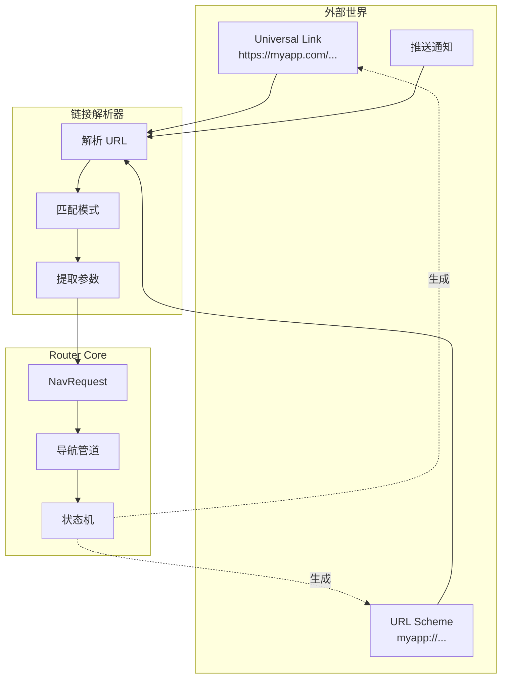

### 13.18 模块状态持久化

模块栈应包含在状态持久化中：

```text
PersistableModuleState {
    active_module: ModuleId,
    module_stacks: Map<ModuleId, Vec<PersistableRoute>>,
    // Badge 状态通常不持久化（动态数据）
}
```

---

## 14. 状态恢复（可选功能）

> **注意**：此功能是**可选的**，可能不适合所有应用程序。
> 状态恢复增加了复杂性，需要仔细考虑哪些状态应该持久化，哪些不应该。

### 14.1 概述

移动应用程序可能随时被系统终止（内存压力、用户操作、系统更新）。
状态恢复允许 Router Core 持久化导航状态，并在应用重新启动时恢复它。

### 14.2 何时使用

| 场景                     | 建议       |
| ------------------------ | ---------- |
| 导航较浅的简单应用       | 不需要     |
| 具有复杂多步骤流程的应用 | 考虑启用   |
| 具有敏感/瞬态页面的应用  | 选择性恢复 |
| 启动时需要全新状态的应用 | 禁用       |

### 14.3 可持久化状态模型

```text
PersistableRouterState {
    version: u32,                    // 用于迁移
    timestamp: i64,                  // 持久化时间

    // Tab 状态（如适用）
    tab_container: Option<PersistableTabContainer>,

    // 栈状态
    stacks: Map<Runtime, Vec<PersistableRoute>>,
    active_runtime: Runtime,

    // 不持久化：待处理的转换、动画状态、瞬态数据
}

PersistableRoute {
    name: RouteName,
    path: String,
    params: JsonValue,               // 仅可序列化的参数
    restorable: bool,                // 路由级别的退出选项
}
```

### 14.4 路由级别配置

路由可以配置其恢复行为：

```text
RouteDefinition {
    name: "payment.checkout",
    // ...

    restoration: RestorationConfig {
        // 此路由是否可以恢复
        restorable: false,           // 支付页面不应恢复

        // 跳过恢复时的替代路由
        fallback_route: Some("orders.list"),

        // 从持久化中排除的参数（敏感数据）
        excluded_params: ["card_number", "cvv", "otp"],

        // 此路由恢复的最大有效期
        max_age: Duration::hours(1),
    }
}
```

### 14.5 持久化触发时机

```text
PersistTrigger {
    // 应用进入后台时持久化
    OnBackground,

    // 每次导航后持久化（开销较高）
    OnNavigation,

    // 定期持久化
    Periodic(Duration),

    // 仅对特定路由持久化
    OnCriticalRoute,
}

// 推荐：OnBackground 带防抖
PersistenceConfig {
    trigger: OnBackground,
    debounce: Duration::millis(500),
    max_stack_depth: 10,             // 限制持久化的栈深度
    storage: SecureStorage,          // 平台特定
}
```

### 14.6 恢复流程

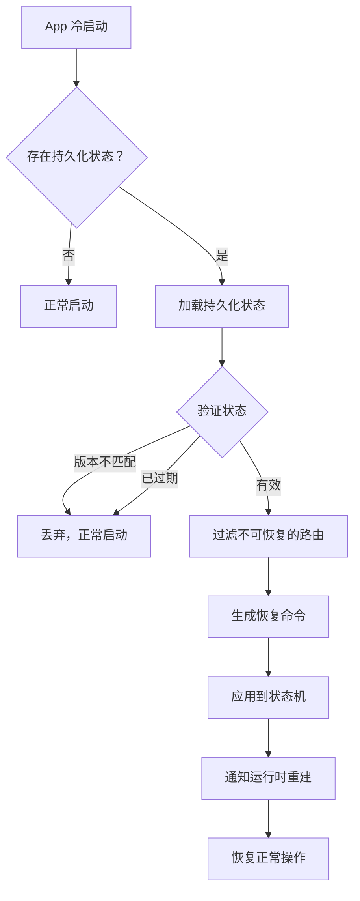

### 14.7 恢复算法

```text
fn restore_state(persisted: PersistableRouterState) -> Result<(), RestoreError> {
    // 1. 版本检查
    if persisted.version != CURRENT_VERSION {
        return Err(VersionMismatch);
    }

    // 2. 过期检查
    if now() - persisted.timestamp > MAX_STATE_AGE {
        return Err(StateExpired);
    }

    // 3. 过滤路由
    let filtered_stacks = persisted.stacks.map(|stack| {
        stack.filter(|route| {
            let def = RouteRegistry.get(route.name);
            def.restoration.restorable &&
            !route.is_expired(def.restoration.max_age)
        })
        .map(|route| {
            // 移除排除的参数
            route.filter_params(def.restoration.excluded_params)
        })
    });

    // 4. 处理空栈（回退到根路由）
    let final_stacks = filtered_stacks.map(|stack| {
        if stack.is_empty() {
            vec![get_root_route()]
        } else {
            stack
        }
    });

    // 5. 应用到状态机
    StateMachine.restore(final_stacks);

    Ok(())
}
```

### 14.8 持久化中间件

RO 中间件可以在导航后触发持久化：

```text
StatePersistenceMiddleware {
    fn on_post(ctx: &NavContext, result: &NavResult) {
        if self.config.trigger == OnNavigation {
            // 异步持久化以避免阻塞
            spawn_async(|| {
                let state = Router.get_persistable_state();
                Storage.persist(state);
            });
        }
    }
}
```

### 14.9 限制和注意事项

1. **页面级状态不会恢复** — 仅恢复导航栈；页面数据（表单、滚动位置）必须由各运行时单独处理。

2. **瞬态路由应退出** — 支付、认证和时间敏感的流程应设置 `restorable: false`。

3. **深度链接可能冲突** — 如果应用被恢复且有待处理的深度链接，深度链接通常优先。

4. **测试复杂性** — 状态恢复增加了需要彻底测试的边缘情况。

5. **存储安全** — 持久化状态可能包含敏感的路由参数；使用安全存储并排除敏感字段。

---

## 15. 讨论

### 15.1 设计权衡

1. **全局真实来源 vs 运行时自治**
   以略微增加的路由延迟为代价确保一致性。

2. **中间件刚性 vs 灵活性**
   受保护的 RW 中间件确保安全性，但限制了某些高级流程。

3. **规范参数合并**
   大大简化了验证，但引入了前期解码开销。

4. **深度链接的管道前解析**
   将 URL 解析与中间件管道分离确保了清晰的 URL 到路由映射，
   但需要维护两个配置点（路由定义 + 深度链接模式）。

5. **Tab 导航状态复杂性**
   支持独立的每 Tab 栈增加了状态管理复杂性，但提供了预期的移动端用户体验模式。

6. **可选的状态恢复**
   将恢复设为可选承认了并非所有应用都能从中受益，但需要有此需求的应用主动启用并仔细配置哪些路由可恢复。

### 15.2 限制

- 动画转换仍然依赖于运行时。
- 大型 Body 负载会产生解码成本。
- Tab 栏 UI 实现不在 Router Core 范围内（由 Native 处理）。
- 状态恢复不涵盖页面内部状态（表单、滚动位置）。
- 延迟深度链接需要第三方 SDK 集成。

---

## 16. 未来工作

- 可插拔动画引擎
- 事务性导航模型
- 预测性状态计算
- 多设备同步导航
- 动态运行时加载
- 静态路由优化
- 基于 Schema 的导航表单自动生成

---

## 17. 结论

本 RFC 定义了一个完整的、统一的导航架构，适用于多运行时移动和混合应用程序。Router Core 确保确定性的导航语义、一致的参数行为、健壮的中间件管道、经过验证的生命周期和隔离的运行时执行。这为复杂的、模块化的现代应用程序创建了一个可预测且可扩展的基础。
